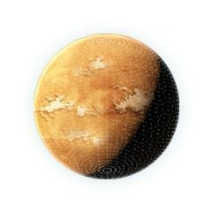
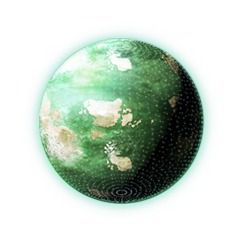
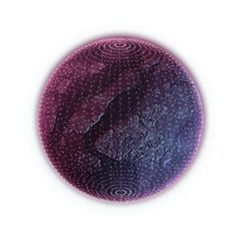

# 惑星
惑星は、国家の基盤になる最も重要な要素です。
惑星に様々な施設を建設することによって、国家を運営するための資源を確保するだけでなく、研究力・艦隊生産力などを確保することができます。
保有惑星が多いほど資源の供給量が増加するので、国家が保有した惑星の質と量が国力に直結します。

# 惑星の環境
惑星の環境により、惑星の外見とボーナスが異なります。
惑星は、計5種類の環境に区分されます。
惑星環境によるボーナスは、各惑星で該当する資源を獲得する際に提供されます。

| 惑星イメージ | 環境の名前 | 説明 |
| --- | --- | --- |
| | オーシャン | 海に覆われた青い惑星です。研究施設の性能が向上します |
| | デザート | 砂漠に覆われた黄色の惑星です。エネルギー施設の性能が向上します |
| | ターレイン | 様々な地形で成り立っている、緑色の惑星です。住居施設の性能が向上します |
| | カーボン| 炭素と様々な鉱物で構成された、赤紫色の惑星です。採光施設の性能が向上します
| | デザート | 最適な環境を持つ惑星であり、非常にまれに存在します。住居、採鉱、研究、エネルギー施設の性能が全て向上します|

# 惑星の等級とレベル
惑星の等級により、その惑星に建設可能な施設の最高レベルと、惑星環境による建物の環境ボーナス量が決定されます。

# 惑星レベルとは
惑星は、開発可能な最大レベルがそれぞれの等級によって定められており、惑星の施設は惑星の最大レベル以上にはアップグレードできません。

| 等級 | 最大レベル | 環境ボーナス | 
|---|---|---|
|D等級|	31 ～ 35	|5 ～ 10 (+%)|
|C等級|	31 ～ 35	|11 ～ 15 (+%)|
|B等級|	36 ～ 40	|20 ～ 25 (+%)|
|A等級|	41 ～ 45	|35 ～ 40 (+%)|
|S等級|	46 ～ 50	|50 ～ 55 (+%)|

# 惑星保有数の限度
惑星はユーザーの国家レベルによって、保有できる個数が決定されます。
ユーザーの国家レベルが20を超えると、「惑星発見」→「惑星占領」を通じて新たな惑星を保有できます。
惑星保有数の限度は、ユーザーの国家レベルが10レベル上がる時ごとに1つずつ増加します。
保有している惑星が多いほど、惑星占領時に必要な資源量が増加します。