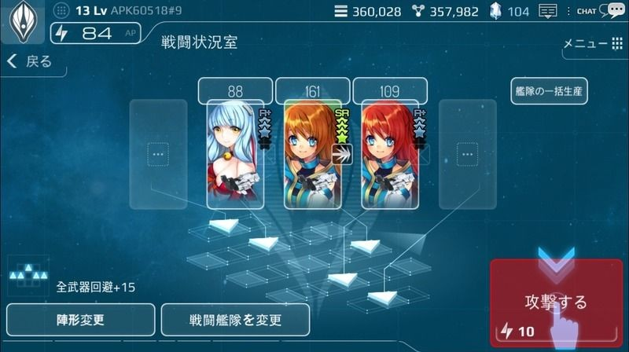

# 戦闘概要

# 戦闘とは
戦闘とは、宇宙空間で艦隊と艦隊が激突して、勝敗を決める行為のことです。

戦闘に出るためには、艦隊と艦長が必要になります。

戦闘で勝利するためには、高性能の艦隊と武器、そして高い能力を持つ英雄が必要になります。

英雄が保有している戦闘スキルは、勝敗に非常に大きな影響を与えます。

戦闘に勝利するためには、敵艦隊を全て撃破する必要があります。

戦闘に勝利しても、自艦隊がダメージが受けていることもあります。

制限ターン内に敵艦隊を全て撃破できなかった場合、

・敵艦隊の防御システムが作動し、ユーザーの艦隊は撤退を余儀なくされます。

・もしくは、敵艦隊が逃走します。

# 戦闘の種類
# 戦争

每日23:00 - 翌22:00までの23時間の間、コスメントをめぐって勃発する紛争です。

各陣営の貢献度を集計して、勝利陣営が決定されます。

20:00-22:00の間は、得られる貢献度がUPします。

戦争で勝利した陣営は、コスメントを採掘する権利を得ることができます。

※22:00-23:00の間は、次の戦争の準備をしています。

[戦争のタイムテーブル]

|  |   | 
| --- | --- | 
|時間|	内容|
|23時～|	戦争開始|
|翌20時～翌22時|	貢献度UP|
|翌22～翌23時|	休戦タイム|

# 特殊任務
宇宙海賊を追跡・撃退していくシナリオです。

勝利すると、報酬を獲得することができます。

報酬アイテムの中には、トロンの製作に必要な部品も含まれています。

# 撃退任務
特殊任務を進行していると、一定の確率で外界艦隊と遭遇します。

攻撃が成功するとゴールドと鉱物を得ることができます。

外界艦隊を撃破すると、外界技術に関連する報酬を受け取ることができます。

# 勝利のための戦略
・兵器と艦隊は、等級が高いほど性能が良いので、戦闘に勝利するためには良い兵器と艦隊が必要不可欠です。

・敵艦隊との相性が最も重要です。そのため、敵艦隊の英雄と艦隊情報を把握することが大事です。

・英雄の職業やスキルを十分に活用する必要があります。

・スキルに適した武器を選択することで、スキルの威力が向上します。

・職業に適した艦隊と武器を選択する必要があります。

・新しい武器や艦隊を手に入れるには、「研究」を進める必要があります。

・基礎研究では、兵器と艦隊の性能を向上させる研究ができます。

・兵器と艦隊には、相性が存在します。敵に対して相性が良い兵器を装備した艦隊はより強力になります。

・スキルにも、相性が存在します。敵艦隊の攻撃スキルに対し、相性が良い防御スキルがあると有利になります。

・敵陣営から勝利を挙げるためには
敵のフォーメーションに対して効果的な兵器やフォーメーションを選択しなければなりません。

・自陣の艦隊数が多い場合、強力な敵から標的とされる可能性があります。

・自陣の艦隊数が少ない場合、強力な攻撃はできません。

 