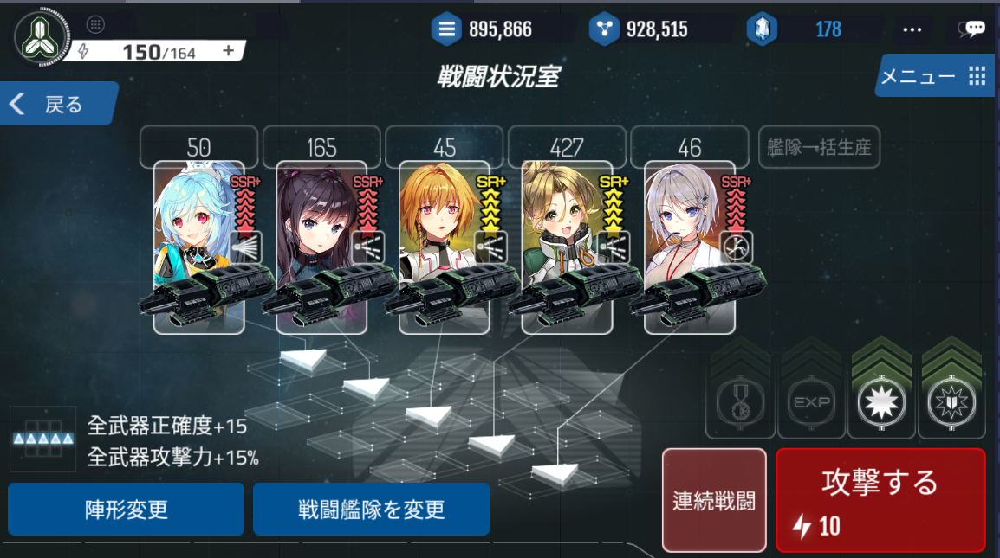

# 戦闘概要

# 戦闘とは
戦闘とは、宇宙空間で艦隊と艦隊が激突して、勝敗を決める行為のことです。

戦闘に出るためには、艦隊と艦長が必要になります。

戦闘で勝利するためには、高性能の艦隊と武器、そして高い能力を持つ英雄が必要になります。

英雄が保有している戦闘スキルは、勝敗に非常に大きな影響を与えます。

戦闘に勝利するためには、敵艦隊を全て撃破する必要があります。

戦闘に勝利しても、自艦隊がダメージが受けていることもあります。

制限ターン内に敵艦隊を全て撃破できなかった場合、

・敵艦隊の防御システムが作動し、ユーザーの艦隊は撤退を余儀なくされます。

・もしくは、敵艦隊が逃走します。

# 戦闘の種類
# 戦争

每日23:00 - 翌22:00までの23時間の間、コスメントをめぐって勃発する紛争です。

各陣営の貢献度を集計して、勝利陣営が決定されます。

20:00-22:00の間は、得られる貢献度がUPします。

戦争で勝利した陣営は、コスメントを採掘する権利を得ることができます。

※22:00-23:00の間は、次の戦争の準備をしています。

[戦争のタイムテーブル]

|  |   | 
| --- | --- | 
|時間|	内容|
|23時～|	戦争開始|
|翌20時～翌22時|	貢献度UP|
|翌22～翌23時|	休戦タイム|

# 特殊任務
宇宙海賊を追跡・撃退していくシナリオです。

勝利すると、報酬を獲得することができます。

報酬アイテムの中には、トロンの製作に必要な部品も含まれています。

# 撃退任務
特殊任務を進行していると、一定の確率で外界艦隊と遭遇します。

攻撃が成功するとゴールドと鉱物を得ることができます。

外界艦隊を撃破すると、外界技術に関連する報酬を受け取ることができます。

# 討伐
後方を撹乱する悪い奴らを討伐しに行く任務です。

討伐する任務は国家レベル20レベル達成すると、開始できます。

# 征伐
シナリオに沿って悪党の本拠地に攻撃する任務です。

ステージに勝利するとゴールドと鉱物、DNAコア、特定のドロップボックスを受け取ることができます。

星の獲得個数によって追加で報酬を受けることができます。

# リーグ
リーグは50レベル以上になると楽しめるコンテンツです。

同じような国力の国家を結びつけ、お互いに競争し合います。

防御フォーメーションを公開し、戦闘結果を細分化し、より効果的な戦闘のための戦略に気を配ります。

毎ラウンドごとにコスメント資源を獲得することができ、高い順位になるほど受け取れる報酬も高くなります。

リーグポイントを通じて様々アイテムと交換することができます。

# 練習戦闘
友達と演習戦闘をすることができます。 陣営が違っても関係ありません。

一日一回だけ可能で、一般戦闘では受け取れないアイテムを補償として受け取ることもできます。 

補償はランダムです。

# 勝利のための戦略

兵器と艦隊はティアが高くなるほど、性能が優れています。

高い性能を持つ兵器や艦隊は戦闘で勝つうえで必須の条件です。

英雄が持っている様々な職業やスキルをうまく活用しなければなりません。

職業に合う艦隊や兵器を選択しなければなりません。

スキルに合う兵器を選択することでスキルの威力を上げることができます。

新しい兵器や艦隊を作ることができない場合、研究に力を入れる必要があります。

基礎研究には兵器や艦隊の性能を上げる研究があります。

戦闘で勝利するためには相性の概念を十分理解する必要があります。

兵器と艦隊には相性が存在し、特定の兵器に相性の良い艦隊を合わせることで強くすることができます。

 スキルにはスキル同士相性が存在します。特定の攻撃スキルは相性の良い防御スキルで対応すると効率が良いです。

 特定のフォーメーションを相手に戦闘に勝利するためには相手のフォーメーションとは対極の兵器を装着したり、相手に合わせたフォーメーションを選択しなくてはなりません。

 何よりも相手との相性がとても重要になっています。自分が必ず勝利したい相手であれば相手の英雄と艦隊の情報を把握することが何よりも重要になってきます。

 艦隊の艦船の数が多ければ強力な敵軍のターゲットになることができます。

逆に艦隊の艦船の数が十分でなければ、強力な攻撃をすることができません。
