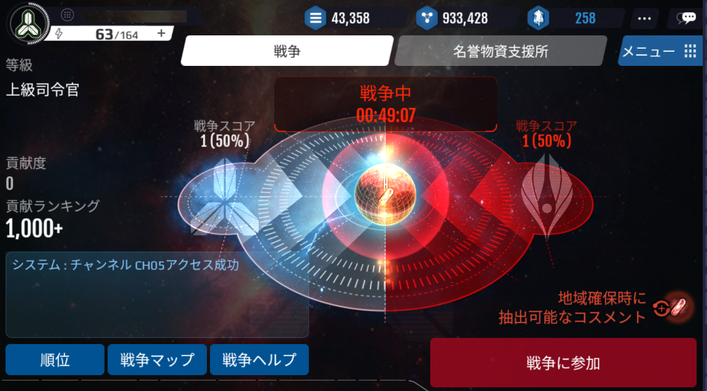
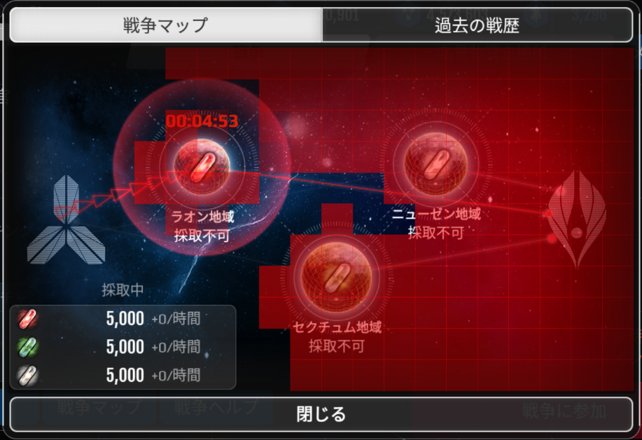
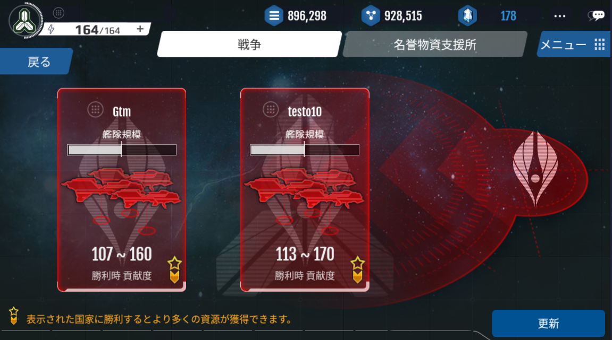

# 戦争

# 戦争とは
このゲームの重要なコンテンツです。国家レベル10以上から参加することができます。

この「戦争」で対戦する相手は、敵陣営のユーザーです。

戦争で勝利すると、コスメントを獲得することができます。

戦争は両陣営の戦いとなるため、全てのユーザーの獲得ポイントを総合して、陣営間の勝敗が決定されます。

勝利した陣営には、コスメントの採掘権が与えられます。

「貢献度」という概念で、ランキングが決められます。

貢献度ランキングにより名誉ポイントを獲得することができます。

名誉ポイントは、ショップで特別な補償と交換することができます。

様々なシステムが存在するため、システムをよく理解していなければなりません。

# 戦争システム

# 戦争地域と時間
ラオン、ニューゼン、セクテュムを採掘できる3つの区域が存在し、戦争が繰り広げられます。

1つの地域の戦争は23時間の間繰り広げられ、戦争が終了すると、1時間の間休戦時間が与えられます。

休戦中は、相手を攻撃することも反撃することもできません。

勝利した陣営は、48時間の間該当する地域のコスメントを採掘することができます（該当する地域での次の戦争開始まで）

# 戦争相手国
戦争画面にて、攻撃可能な相手国のリストが表示されています。

このリストは、自身のレベルを基準に複数のグループに分けられます。

自分が含まれているグループと、一段階下のグループ、二段階下のグループまで合計3つの対戦国家が表示されます。

適切な相手国家がいない場合は、リストが出てこないか、または2人以下の相手国が表示されます。

適切なターゲットが存在しない場合は、画面右下にある「更新」ボタンからリストを更新してみてください。

シールドの保護を受けている対象は、表示されません。

自分と同レベルの相手は星マークが表示され、その相手に勝利すると、より多くの報酬を受け取ることができます。

# 勝敗の基準
戦争では、相手の艦体を全て撃破すると勝利となります。

自分の艦隊が全て撃破されるか、敵艦隊を全て撃破できない場合、敗北となります。

戦争では、貢献度をより多く獲得した陣営が勝利となります。

貢献度は、味方の陣営が獲得したものを全て合わせて計算されます。

# 報酬
戦争で勝利すれば、コスメントを獲得することができます。

戦争が発生している地域のコスメントのみ獲得可能です。

戦争に参加すると、国家と英雄の経験値を獲得できます。

敗北した場合でも英雄は経験値を獲得できますが、獲得経験値は半分となります。

国家レベルがアップするほど、より多くのコスメントを獲得することができます。

星マークの相手に勝利すると、より多くのコスメントを獲得することができます。

戦争に勝利すると、ゴールドと鉱物を得ることができます。

相手のレベルが高いほど、より多くのゴールドと鉱物資源を受け取ることができます。

相手のレベルが高いほど、また、相手が貯めている資源が多いほど、より多くの資源を略奪してくることができます。

星マークの相手に勝利すると、獲得できるゴールドと鉱物、コスメントの量が倍増します。

| | 基本報酬| 追加報酬|
|---|---|---|
||レベルの高い相手ほど増加 | レベルの高い相手ほど増加
|ゴールドと鉱物|レベルが低い相手ほど低下|資源が多い相手ほど増加|
||星マークのついた相手に勝利時、勝利報酬|貢献度200％獲得|
| | | 	貢献度200％獲得|

# 陣営報酬

戦争で勝利した陣営は、その地域での次の戦争開始まで、該当する地域に埋蔵されているコスメントを採掘できる権利を与えられます（計48時間）。

敗北した陣営は、次の戦争地域で貢献度ボーナスを受け取ることができます。

# 貢献度報酬
戦争では一度の戦闘毎に貢献度を獲得することができます。

攻撃に失敗しても、貢献度を獲得することができます。

また、「防御」に成功すると、貢献度を獲得することができます。

国家レベルが高いほど、より多くの貢献度を獲得できます。

貢献度報酬は、各々の国家レベルを基準に、複数のグループに分かれて報酬が支給されます。

貢献度は、該当する地域の戦争が終了すると、初期化されます（每日リセットされます）。

貢献度ランキングに応じて、名誉ポイントを受け取ることができます。

名誉ポイントは、ショップで特別な報酬と交換することができます。

ショップの商品は全てランダムに表示されており、利用した名誉ポイント分差し引かれます。

# 貢献度報酬グループ
| | | |
| --- | --- | --- |
|グループ|レベル|呼称|
|新任司令官(第1グループ)|	10～29レベル|	新任司令官|
|中級司令官(第2グループ)|	30～49レベル|	中級司令官|
|上級司令官(第3グループ)|	50～69レベル|	上級司令官|
|総司令官(第4グループ)	|70～99レベル|	総司令官|
|最高司令官(第5グループ)|	100レベル以上|	最高司令官|

＊現在、レベルキャップは80となっています。

[グループ別ランキング報酬の内訳]

|ランキング | グループ | 名誉ポイント| ゴールド | 鉱物 |
| --- | --- | --- |  --- | --- |
|| 新任司令官(第1グループ) | 120 |
| | 中級司令官(第2グループ)| 150|
|TOP1 | 上級司令官(第3グループ)	| 200  |名誉ポイント×10,000 | 名誉ポイント×5,000 |
| | 総司令官(第4グループ) | 250 |
| | 最高司令官(第5グループ)	| 300 |
|| 新任司令官(1グループ) | 100 |
| | 中級司令官(2グループ)| 120|
|TOP3 | 上級司令官(3グループ)| 150  |名誉ポイント×10,000 | 名誉ポイント×5,000 |
| | 総総司令官(4グループ)| 200 |
| | 最高司令官(5グループ)	| 250 |
|| 新任司令官(1グループ) | 100 |
| | 中級司令官(2グループ)| 120|
|TOP3 | 上級司令官(3グループ)| 150  |名誉ポイント×10,000 | 名誉ポイント×5,000 |
| | 総総司令官(4グループ)| 200 |
| | 最高司令官(5グループ)	| 250 |
||新任司令官(1グループ)|80||
||中級司令官(2グループ)|100|
|TOP5|上級司令官(3グループ)|120|名誉ポイント×10,000	|名誉ポイント×5,000|
||総司令官(4グループ)|150|
||最高司令官(5グループ)|60|
||新任司令官(1グループ)|80|
||中級司令官(2グループ)|100|
|TOP10|上級司令官(3グループ)|100|名誉ポイント×10,000	|名誉ポイント×5,000|
||総司令官(4グループ)|120|
||最高司令官(5グループ)|150|
||新任司令官(1グループ)|50|
||中級司令官(2グループ)|60|
|TOP20|上級司令官(3グループ)|80|名誉ポイント×10,000	|名誉ポイント×5,000|
||総司令官(4グループ)|100|
||最高司令官(5グループ)|120|
||新任司令官(1グループ)|40|
||中級司令官(2グループ)|50|
|TOP30|上級司令官(3グループ)|60|名誉ポイント×10,000	|名誉ポイント×5,000|
||総司令官(4グループ)|80|
||最高司令官(5グループ)|100|
||新任司令官(1グループ)|30|
||中級司令官(2グループ)|40|
|TOP50|上級司令官(3グループ)|50|名誉ポイント×10,000	|名誉ポイント×5,000|
||総司令官(4グループ)|60|
||最高司令官(5グループ)|80|
||新任司令官(1グループ)|25|
||中級司令官(2グループ)|30|
|TOP70|上級司令官(3グループ)|40|名誉ポイント×10,000	|名誉ポイント×5,000|
||総司令官(4グループ)|50|
||最高司令官(5グループ)|60|
||新任司令官(1グループ)|20|
||中級司令官(2グループ)|25|
|TOP100|上級司令官(3グループ)|30|名誉ポイント×10,000	|名誉ポイント×5,000|
||総司令官(4グループ)|40|
||最高司令官(5グループ)|50|
||新任司令官(1グループ)|15|
||中級司令官(2グループ)|20|
|TOP150|上級司令官(3グループ)|25|名誉ポイント×10,000	|名誉ポイント×5,000|
||総司令官(4グループ)|35|
||最高司令官(5グループ)|40|
||新任司令官(1グループ)|10|
||中級司令官(2グループ)|15|
|TOP200|上級司令官(3グループ)|20|名誉ポイント×10,000	|名誉ポイント×5,000|
||総司令官(4グループ)|25|
||最高司令官(5グループ)|30|
||新任司令官(1グループ)|5|
||中級司令官(2グループ)|10|
|TOP300|上級司令官(3グループ)|15|名誉ポイント×10,000	|名誉ポイント×5,000|
||総司令官(4グループ)|20|
||最高司令官(5グループ)|25|