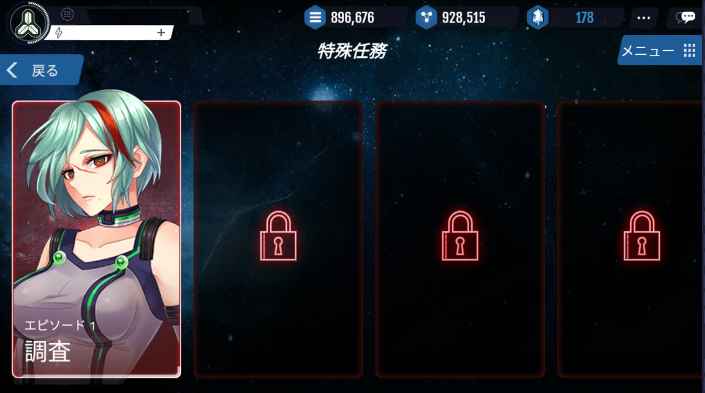
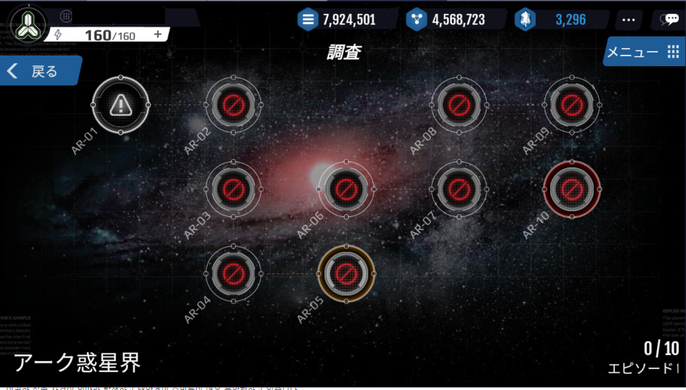

# 特殊任務

特殊任務は、宇宙海賊を相手にする特殊なシナリオモードです。

特殊任務は、エピソード毎に10のステージが用意されており、エピソードは合計で14個存在します。

各エピソードにはNPCが登場し、ステージをクリアすると、資源とアイテムを報酬として獲得できます。

特殊任務の進行中は、外界艦隊に遭遇することもあります。

# シナリオ
最近、謎の艦船失踪事件が頻繁に発生しています。

奇妙なことにこの失踪事件では、失踪した艦船の痕跡すら見つけられていません。

つい最近事件が発生したアーク惑星系は、私たちの主力艦隊が敷かれた地域から遠くないところです。

こうした失踪事件が相次いで発生し、太陽系の住民が非常に不安に思っています。

司令官のあなたは、アーク惑星系に艦隊を派遣し、この事件の調査を遂行してください。

# 登場NPC

||||||
|---|---|---|---|---|
|Episode 1|Episode 2|Episode 3|Episode 4|Episode 5|

||||||
|---|---|---|---|---|
|Episode 6|Episode 7|Episode 8|Episode 9|Episode 10|

|||||
|---|---|---|---|
|Episode 11|Episode 12|Episode 13|Episode 14|

# 特殊任務内容

|エピソード|タイトル|	惑星系|	内容|
|---|---|---|---|
|1	|調査|	アーク|	謎の失踪事件～艦隊が跡形もなく消えてしまった ！|
|2	|追跡|	クロン|	怪しい艦隊との遭遇～未知の地域で発見された不審な艦隊を追跡せよ ！|
|3	|分析|	デルタ|	データコアの分析～データコアの分析を完了して新兵器の秘密を明らかにせよ！|
|4	|ジオジャク|	エオス|	ジオジャク逮捕作戦～違法な武器を開発する科学者・ジオジャクを生け捕りにせよ ！|
|5	|黒幕|	フリード|	背後追跡～違法な武器開発を支援する勢力を明らかにせよ ！|
|6	|略奪|	ジャイロ|	略奪阻止～ダリオ艦隊の無慈悲な略奪からジャイロ惑星系を救え ！|
|7	|防御|	ヒンダー|	虐殺からの救い～ダリオ艦隊の無差別虐殺からヒンダー惑星系を救え ！|
|8	|アストロ娘|	アイジュール|	防御システムの操作～アイジュール惑星系の防御システムが起動するまで時間を稼げ ！|
|9	|逆襲|	ジンク|	生産基地の破壊～敵の主力艦隊の生産基地を発見した。焼きつくせ ！|
|10	|決戦|	リーチ|	反乱鎮圧～反乱を計った敵を一網打尽にせよ。最後の決戦！|
|plus+|

# 特殊任務一覧

|エピソード|ステージ|レベル|npcキャラ|ゴールド|鉱物|経験値|
|---|---|---|---|---|---|---|
|1|	1|  1	|怪しい艦隊|	500|	250|	10|
|1|	2|	2	|怪しい艦隊|	600|	300|	11|
|1|	3|	3	|怪しい艦隊|	700|	350|	11|
|1|	4|	4	|怪しい艦隊|	800|	400|	12|
|1|	5|	5	|怪しい艦隊|	900|	450|	12|
|1|	6|	6	|怪しい艦隊|	1100|	550|	12|
|1|	7|	7	|怪しい艦隊|	400|	700|	13|
|1|	8|	8	|怪しい艦隊|	1700|	850|	13|
|1|	9|	9	|怪しい艦隊|	2000|	1000|	14|
|1|	10|	10	|クノース偵察艦隊|	2500|	1250|	14|
|2|	1|	11	|クノース偵察艦隊|	3000|	1500|	14|
|2|	2|	12	|クノース偵察艦隊|	4200|	2100|	15|
|2|	3|	13	|クノース偵察艦隊|	4700|	2350|	15|
|2|	4|	14	|クノース偵察艦隊|	5200|	2600|	16|
|2|	5|	15	|クノース精鋭艦隊|	5700|	2850|	16|
|2|	6|	16	|クノース艦隊|	6200|	3100|	16    |
|2|	7|	17	|クノース艦隊|	6700|	3350|	17    |
|2|	8|	18	|クノース艦隊|	7300|	3650|	17    |
|2|	9|	19	|クノース艦隊|	7900|	3950|	18    |
|2|	10|	20	|クノース精鋭艦隊|	8500|	4250|	18|
|3|	1|	21	|クノース奇襲艦隊|	14000|	7000|	18|
|3|	2|	22	|クノース奇襲艦隊|	15000|	7500|	19|
|3|	4|	23	|クノース奇襲艦隊|	16000|	8000|	19|
|3|	5|	24	|クノース奇襲艦隊|	17000|	8500|	20|
|3|	6|	25	|クノース精鋭艦隊|	18000|	9000|	20|
|3|	7|	26	|クノース奇襲艦隊|	20000|	10000|	20|
|3|	7|	27	|クノース奇襲艦隊|	21000|	10500|	21|
|3|	8|	28	|クノース直轄艦隊|	22000|	11000|	21|
|3|	9|	29	|クノース直轄艦隊|	24000|	12000|	22|
|3|	10|	30	|クノース	|34000|	17000|	22        |
|4|	1|	31	|ジオジャク	|36000|	18000|	22        |
|4|	2|	32	|ジオジャク艦隊|	38000|	19000|	23|
|4|	3|	33	|ジオジャク艦隊|41000|	20500|	23    |
|4|	4|	34	|ジオジャク艦隊|	43000|	21500	24|
|4|	5|	35	|ジオジャク	|46000|	23000|	24        |
|4|	6|	36	|ジオジャク	|49000|	24500|	24        |
|4|	7|	37	|ジオジャク	|52000|	26000|	25        |
|4|	8|	38	|ジオジャク	|55000|	27500|	25        |
|4|	9|	39	|ジオジャク	|58000|	29000|	26        |
|4|	10|	40	|ジオジャク	|70000|	38500|	26        |
|5|	1|	41	|ジオジャク残存艦隊|	77000|	38500|	26|
|5|	2|	42	|ジオジャク残存艦隊|	77000|	38500|	27|
|5|	3|	43	|ダリオー艦隊|	77000|	38500|	27    |
|5|	4|	44	|ダリオー艦隊|	77000|	38500|	28    |
|5|	5|	45	|ダリオー直轄艦隊|	77000|	38500|	28|
|5|	6|	46	|ダリオー艦隊|	77000|	38500|	28    |
|5|	7|	47	|ダリオー艦隊|	77000|  38500|	29    |
|5|	8|	48	|ジオジャク残存艦隊|	77000|	38500|	29|
|5|	9|	49	|ダリオー艦隊|	77000|	38500|	30    |
|5|	10|	50	|ダリオー直轄艦隊|	92000|	46000|	30|
|6|	1|	51	|ダリオー略奪艦隊|	92000|	46000|	30|
|6|	2|	52	|ダリオー略奪艦隊|	92000|	46000|	31|
|6|	3|	53	|ダリオー略奪艦隊|	92000|	46000|	31|
|6|	4|	54	|ダリオー略奪艦隊|	92000|	46000|	32|
|6|	5|	55	|ダリオー略奪艦隊|	92000|	46000|	32|
|6|	6|	56	|ダリオー艦隊|	92000|	46000|	32    |
|6|	7|	57	|ダリオー艦隊|	92000|	46000|	33    |
|6|	8|	58	|ダリオー直轄艦隊|	92000|	46000|	33|
|6|	9|	59	|ダリオー直轄艦隊|	92000|	46000|	34|
|6|	10|	60	|ダリオー精鋭艦隊| 110000|	55000|	34|
|7|	1|	61	|カーソラ艦隊|	110000|	55000|	34    |
|7|	2|	62	|カーソラ艦隊|	110000|	55000|	35    |
|7|	3|	63	|カーソラ艦隊|	110000|	55000|	35    |
|7|	4|	64	|カーソラ艦隊|	110000|	55000|	36    |
|7|	5|	65	|カーソラ精鋭艦隊|110000|	55000|	36    |
|7|	6|	66	|カーソラ艦隊|	110000|55000|	36    |
|7|	7|	67	|カーソラ艦隊|	110000|55000|	37    |
|7|	8|	68	|カーソラ精鋭艦隊|110000|	55000|	37    |
|7|	9|	69	|カーソラ精鋭艦隊| 110000|	55000|	38|
|7|	10|	70	|カーソラ直轄艦隊|120000|	60000|	38|
|8|	1|	71	|カーソラ艦隊|	120000| 60000|	38    |
|8|	2|	72	|カーソラ艦隊|	120000| 60000|	39    |
|8|	3|	73	|カーソラ艦隊|	120000|	60000|	39    |
|8|	4|	74	|カーソラ精鋭艦隊|	120000|	60000|	40|
|8|	5|	75	|カーソラ直轄艦隊|	120000|	60000|	40|
|8|	6|	76	|カーソラ艦隊|	120000|	60000|	40    |
|8|	7|	77	|カーソラ精鋭艦隊|	120000|	60000|	41|
|8|	8|	78	|カーソラ精鋭艦隊|	120000|	60000|	41|
|8|	9|	79	|カーソラ直轄艦隊|	120000|	60000|	42|
|8|	10|	80	|カーソラ|	140000|	70000|	42        |
|9|	1|	81	|ダリオー艦隊|	140000|	70000|	42    |
|9|	2|	82	|ダリオー艦隊|	140000|	70000|	43    |
|9|	3|	83	|ダリオー艦隊|	140000|	70000|	43    |
|9|	4|	84	|ダリオー艦隊|	140000|	70000|	44    |
|9|	5|	85	|ダリオー直轄艦隊|	140000|	70000|	44|
|9|	6|	86	|ダリオー艦隊|	140000|	70000|	44    |
|9|	7|	87	|ダリオー艦隊|	140000|	70000|	45    |
|9|	8|	88	|ダリオー艦隊|	140000|	70000|	45    |
|9|	9|	89	|ダリオー精鋭艦隊|	140000|	70000|	46|
|9|	10|	90	|ダリオー直轄艦隊|	150000|	75000|	46|
|10|1|	91	|ダリオー精鋭艦隊|	150000|	75000|	46|
|10|2|	92	|ダリオー精鋭艦隊|	150000|	75000|	47|
|10|3|	93	|ダリオー精鋭艦隊|	150000|	75000|	47|
|10|4|	94	|ダリオー精鋭艦隊|	150000|	75000|	48|
|10|5|	95	|ダリオー直轄艦隊|	150000|	75000|	48|
|10|6|	96	|ダリオー直轄艦隊|	150000|	75000|	48|
|10|7|	97	|ダリオー直轄艦隊|	150000|	75000|	49|
|10|8|	98	|ダリオー直轄艦隊|	150000|	75000|	49|
|10|9|	99	|ダリオー直轄艦隊|	150000|	75000|	50|
|10|10|	100	|ダリオー	| 170000|	85000|	50    |
|PLUS|

▼進め方

各ステージをクリアすると、次のステージに進むことができます。

エピソードを全てクリアすると、次のエピソードに進むことができます。

既にクリアしたステージも、何回でも繰り返しプレイできます。

ステージが進むほど、より強力な艦隊が登場します。

各エピソードのステージ4と10はボス戦のため、より強力な敵が登場します。

1つのステージに挑戦するのには、10APが必要です。

クリア報酬

各ステージをクリアすると、ゴールドと鉱物、経験値を獲得することができます。

エピソードが進むほど、より多くのゴールドと鉱物、経験値を獲得します。

ステージを初めてクリアする場合、より豪華なアイテムを獲得できます。

報酬アイテムは、伏せられたカード3枚の中からいずれかを選択する必要があります。

報酬アイテムの中には、トロンの製作に必要なトロン部品を獲得できる場合もあります。

▼もう一枚引く

報酬を受け取った後、10クリスタルで残り2枚のカードの内いずれかもう一枚引くことができます。

# エピソード
各キャンペーンには計14個のエピソードがあります。

1 つのエピソードは、14個のステージで構成されています。

各エピソードごとに異なるNPCが登場し、彼らは英雄と同じく、ランクに応じてその能力が異なります。

エピソードが進めば進むほど、より強敵のNPCが登場します。