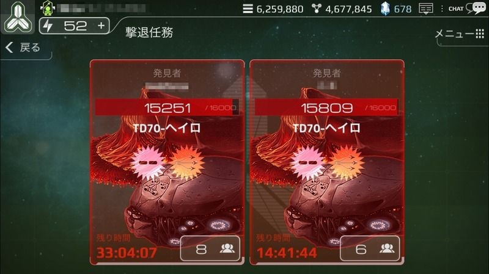

# 撃退任務

# 撃退任務とは

「特殊任務」を進行中、一定の確率で外界艦隊に遭遇します。

外界艦隊の正体は、誰も知りません。彼らは非常に神秘的な存在で、彼らの科学技術力は私たちよりはるかに上回っており、非常に強大な攻撃力と防御力を有しています。

外界艦隊を撃退するためには、同盟のサポートが必要となります。

# 外界艦隊出現

特殊任務のエピソード毎に、登場する外界艦隊、及び、その登場確率が決まっています。

エピソードが進めば進むほど、より一層強力な外界艦隊が出現します。

一度に二つ以上の外界艦隊を発見することはできません。

ユーザーが発見した外界艦隊を撃退後、再度発見することができます。

ユーザー自身の撃退任務の有無に関係なく、同盟の撃退任務を支援することはできます。

規程時間内に外界艦隊を撃退できなければ、外界艦隊は宇宙のかなたに消え、報酬を受け取ることもできません。

# 撃退任務の攻略

外界艦隊を発見すると、まず第一発見者に攻撃権が与えられ、その後自動的に同盟のサポートが要請されます。

一つの外界艦隊に対して、最大20の同盟の支援を受けることができます。

外界艦隊の弱点は、外界艦隊が保有している武器で攻撃することです。

外界艦隊に与えたダメージの量により、同盟の貢献順位が決まります。

外界艦隊に1ダメージでも与えられない場合、撃退任務に参加したとは認められません。

# 撃退任務の報酬
外界艦隊を制限時間内に撃退すれば、報酬が獲得できます。

外界艦隊への攻撃が成功すると、ゴールドと鉱物、英雄と国家の経験値を獲得できます。

すべての参加者は、参加報酬アイテムを獲得でき、自分が与えたダメージに応じた暗黒物質を獲得できます。

外界艦隊の発見者は、ボーナス報酬を獲得でき、時折特別なアイテムも獲得できます。

同盟内で最も貢献したユーザは、ボーナス報酬を獲得でき、時折レアなアイテムも獲得できます。

まれに、外界技術を習得できる非常に珍しいキューブを獲得できます。

# Tips
外界艦隊を撃退するためには、レベルが高い同盟の支援が必要です。

ユーザーの国家レベルより低い同盟の撃退任務に参加すると効率的です。

外界技術の研究には、撃退任務で獲得できる外界技術キューブと暗黒物質が必要です。