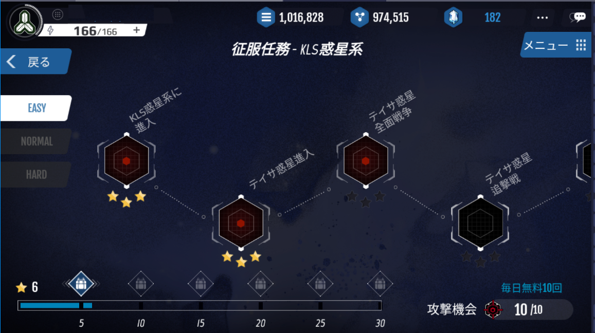
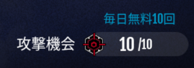

# 征服

悪党たちの本拠地を攻撃する任務です。

征服任務は通常の戦闘とは違い、1つの艦隊をすべて破壊すると、次の艦隊が現れ、破壊するとさらに次の艦隊が登場します。通常3つの艦隊が連続で登場し、最大で5つ登場します。

コラボ専用特殊任務を征服任務を通じて開催することもあります。

# 征服地域

征服任務は征服地域単位で追加となります。

各征服地域は開始可能なレベルに制限があります。

各征服地域は、いくつかのステージで構成されます。

# 征服難易度

複数のステージで構成された征服地域は3つの難易度(EASY、NORMAL、HARD)で構成されます。

難易度1の最後のステージをクリアすると次の難易度に進むことができます。

# 星の獲得
各難易度のステージ攻撃し成功すると、勝利した状況により星が1～3個支給されます。

基本的な星の獲得条件は次の通りです。

■ 最後の戦闘で勝利した場合: 星1つ

■ 最後の戦闘に勝利し、全体艦隊の被害が50％以下だった場合: 星2つ

■ 最後の戦闘で勝利し、全体艦隊の被害が50％以下で全ての艦隊が生存状態だった場合: 星3つ

# 征服別の報酬
各征伐地域の難易度と獲得した星に応じて、1回限りの報酬を支給します。

各難易度別に最大30個の星を獲得可能です。

報酬は星5個、10個、15個、20個、30個を獲得するタイミングで1回限りの報酬を支給します。

# 征服機会
征伐戦闘を行うためには10APのほかに征伐機会が必要です。

征伐機会は毎日10個が無料で提供されます。

征伐機会はクリスタルを使用して毎日10回追加チャージができます。 (計100回)

一度チャージするたびに10個ずつチャージされ、そのたびに必要クリスタルが増加します。

# 征服戦闘

征服戦闘は2~5程度の艦隊と連続的に戦闘を繰り広げる形式です。

戦闘の後にはステージと難易度に応じて一定比率の艦隊が修理されます。

# 勝利報酬

勝利すると資源とアイテムを報酬として受け取れます。

征服にしか出てこない英雄訓練アイテムを一定確率で獲得できます。

探索燃料やドロップアイテムも一定確率で獲得することができます。

