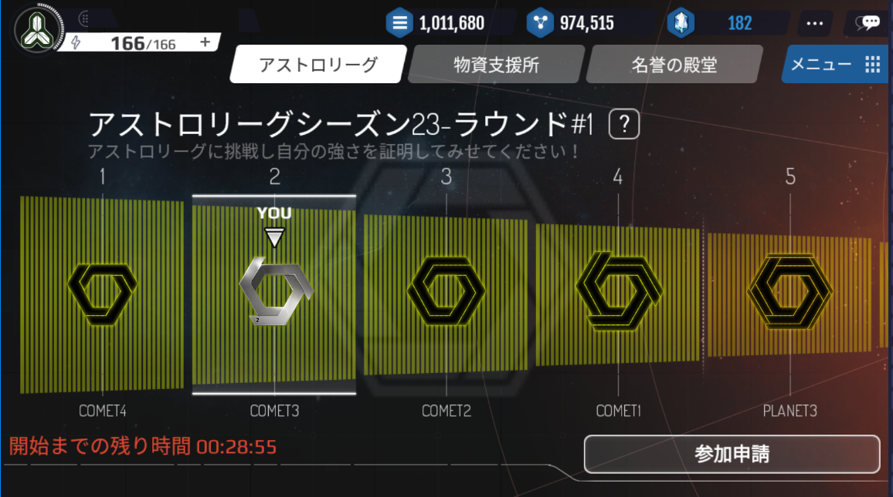
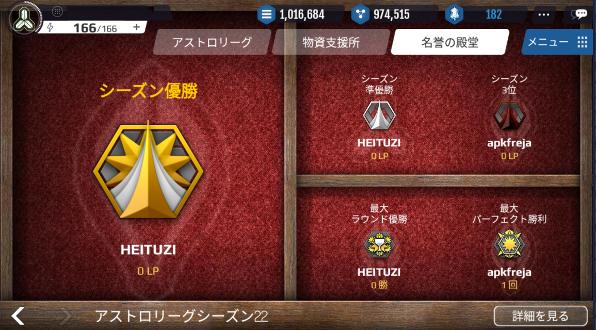

# リーグ

# リーグの概要

リーグは50レベル以上から参加できるコンテンツです。

同水準の国力の国家同士でマッチングされ、お互いに競い合います。

防御フォーメーションが公開され、戦闘結果も細分化されるため、戦略の重要性が高まります。

# リーグ日程
リーグはシーズン制で運営されます。

リーグが始まると計5ラウンドが実施されその後リーグが終了します。

その後、一定の休戦期間が設けられ、報酬を受け取り、新しいリーグの開始を待ちます。

1ラウンドは7日間に渡り進行されます。

	■ 申請期間: 2日
	■ 戦闘期間: 3日
	■ 終了期間: 2日

# 等級構成および昇降制

リーグは計11の等級により構成されます。

1. 50 ~ 54レベル(1等級)
2. 55 ~ 59レベル(2等級)
3. 60~64レベル(3等級)
4. 65~69レベル(4等級)
5. 70~74レベル(5等級)
6. 75~79レベル(6等級)
7. 80~84レベル(7等級)
8. 85~89レベル(8等級)
9. 90~94レベル(9等級)
10. 95~99レベル(10等級)
11. 100~110レベル(11等級)
12. 最上位レベル (12等級)

進行中、レベル変更により等級が変更になる場合があります。

# 参加申請およびグループ編成

リーグは参加申請を行う必要があります。

リーグへの参加申請は等級別に異なるゴールドを参加費として支払う必要があります。

各リーグ別に適切な人数(10~20人)を振り分けます。

参加者数が最低人数(10人)を下回る場合、該当のリーグは中止となり、参加費が払い戻されます。

# 星の獲得基準

戦闘の結果が勝利/敗北ではなく、攻撃側の星の獲得数で表されます。(0~5個)

  1. 防御艦隊の破壊率に応じて

  ■ 100%破壊時: 星3個

  ■ 66.6%以上破壊時: 星2個

  ■ 33.3%以上破壊時: 星1個

  ■ それ以下の場合: 星0個

  2. 攻撃艦隊の破壊率に応じて

  ■ 33.3%以下で破壊された場合: 星2個

  ■ 66.6%以下で破壊された場合: 星1個

  ■ それ以上の場合: 星0個

# 終了および報酬

戦闘期間がすべて経過し、リーグが終了するとランキング別に報酬が支給されます。

  ■ 獲得した星の数: コスメントの量に比例

  ■ 最終順位: リーグポイントの量に比例

各グループで上位25%は上位リーグに昇級します。

各グループで下位25%は下位グループに降級します。

# 名誉の殿堂

1シーズンが終了すると全体シーズンでの記録に応じて、名誉の殿堂を構成し、次に該当するプレイヤーの記録を残します。

  ■ 最終優勝者: リーグポイント最多獲得

  ■ ラウンド最多優勝者

  ■ 星5個最多獲得勝利者(パーフェクト勝利)

  