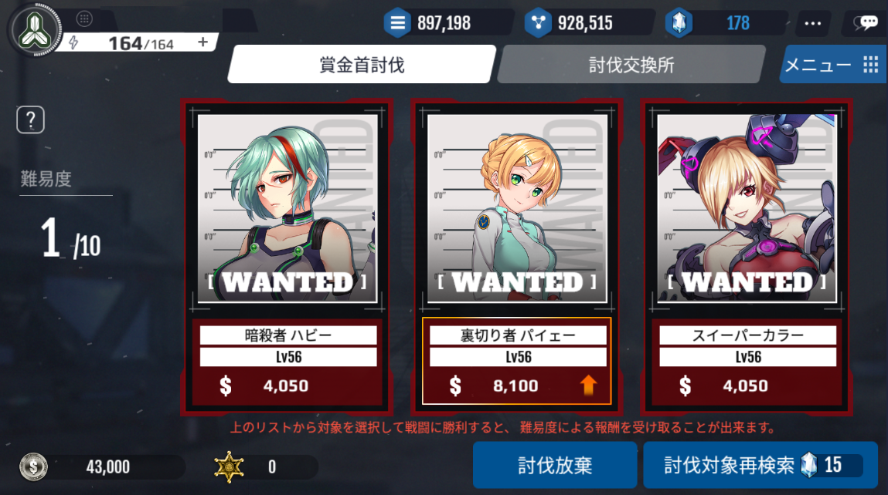
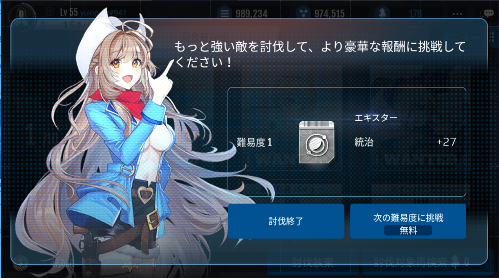

# 討伐任務

戦場にて暗躍する様々なタイプの敵艦隊(NPC)を討伐する任務です。

それぞれの敵タイプを看破し、勝利を勝ち取ると、討伐報酬がグレードアップしていきます。

# 討伐任務参加
討伐任務には、国家レベル20以上から参加可能です。

討伐任務は、12時間毎に1回、無料で参加可能です。

討伐任務終了後、もしくは討伐任務に失敗してから12時間経過する前のタイミングでも、20クリスタルを使用するとすぐに討伐任務に参加できます。

討伐対象一覧画面にて討伐対象を更新するためには、15クリスタルを使用する必要があります。

# 討伐任務の進行
討伐任務は、全部で10段階にて構成されています。

それぞれの段階毎に難易度が上昇していき、新しい戦闘タイプの討伐対象が登場します。

また、段階が進むほど討伐報酬が豪華になっていきます。

1段階クリアするごとに、報酬を受け取って討伐終了とするか、その報酬を破棄して、さらに豪華な報酬を目指して討伐に参加するかを選択できます。

10段階全てをクリアした際は、報酬を受け取り終了しますが、途中で失敗すると報酬はもらえません。

討伐任務に参加するためには、10APが必要です。

[討伐任務進行]

# 討伐任務の報酬

討伐任務では、一段階クリアするたびに、鉱物とゴールド、そしてトロンの強化部品となるエキスターが報酬として獲得できます。

段階が進むほど、強力なエキスターを報酬として受け取ることができます。

各段階での難易度と国家レベルを基準として、報酬のエクスターのレベルが決定されます。

[討伐任務報酬]

新しいエキスター、または、さらに強いエキスターを得るために、次の討伐を行うことができます。

15クリスタルを使用すると、討伐対象を変更することができます。

また、討伐任務に参加後12時間を待たずに、20クリスタルを使用することですぐに討伐任務に参加することもできます。

# 討伐対象(敵艦隊NPC)

|名前|タイプ|説明||
|---|---|---|---|
|凶悪犯 ハイグ|ビーム回避強化型 | ハイグは我々の陣営で凶悪な犯罪者です。必ず逮捕して、法の審判を受けさせましょう。|
|暗殺者 ハビー|ミサイル回避強化型| ハビーは私達の連合の有望な指導者を暗殺した指名手配犯です。逃走中の犯人を逮捕しましょう！ |
|扇動者 マイベス|戦闘艇回避強化型|マイベスはマッドサイエンティストで、数多くの違法行為を起こしました。追跡して、その信者達を殲滅しましょう！|
|密輸屋 アル・ハザール|キャノン回避強化型|ブラックスターの幹部を務めるアル・ハザールは密輸および殺人など凶悪事件の容疑者です。大至急、逮捕しなければいけません。|
|毒蛇 クィンシー     |回避強化型|ブラックスターの幹部の1人であるクィンシーは毒劇物の製造で悪名高い人物です。彼女を逮捕して毒劇物を回収しましょう！|
|イージーメンスン     |ビーム、キャノン回避強化型|メンスンはEZ惑星界で有名な犯罪者です。信奉者達が多いのでご注意ください！|
|裏切り者 パイェー   |ミサイル、戦闘艇回避強化型|パイェーはスパイで、我々の機密情報を横流しした疑いが持たれています。追跡してください！|
|捕食者 モリソン    |ミサイル、戦闘艇抵抗強化型|モリソンは強力な傭兵を従える戦争犯罪者である一方、ブラックスター幹部の座に上り詰めた人物です。逮捕に慎重を期してください！|
|凶暴のゲイン       |抵抗強化型|ゲインは犯罪組織の凶悪なリーダーです。暴力的な性格を持っているので逮捕の時には十分に気をつけてください。|
|憎悪のダーマー        |遠距離砲撃型|ダマーは最もおぞましい人物です。我々の連合にとっても脅威ですので、一刻も早く逮捕しましょう！|
|ピエロ クラウン    |遠距離砲撃型|クラウンは爆破魔です。この機会に確実に逮捕した方が良いでしょう！|
|恐怖のユノバマ     |ミサイル専門家|ユノバマは自称芸術家のマッドサイエンティストです。さらに大きな犯罪を起す前に追跡しましょう！|
|反乱者 ホイットマン |近接戦強化型|ホイットマンは反乱を起した後、勢力を拡大中の逃亡者です。逮捕して惑星界に安全を取り戻してください。|
|危険なタンズルロ    |ビームエキスパート| タンズ-ロは数百件におよぶ犯罪に関わった指名手配犯です。凶悪な仲間を集めているとの情報があります。|
|教主 レックター      |キャノン抵抗強化型|レックターは怪しい教えを広めているリーダーです。いくつかの犯罪に関わっているので、一刻も早く逮捕しましょう。|
|怪しいマリンス     |戦闘艇アナリスト| マリンスは外郭惑星系で隠密に軍事集団を組織した危険な人物です。ブラックスターの4人の幹部のうちの1人と推定されます。何を考えているのか分からない人物です。注意してください！|
|逃亡者 ベリーヤ     |ビーム、キャノン抵抗強化型|ベリーヤは民間の商船を攻撃した後、逃走中の犯罪者です。逮捕して後悔させてあげましょう！|
|コウモリ ベイトマーン|ミサイル、戦闘艇抵抗強化型|有名な海賊団のリーダーであるベイトマーンに関しては、まだ情報がほとんどありません。限られた情報ですが、追跡してください！|
|搾取者 リーファー    |ミサイル、戦闘艇抵抗強化型| ”搾取者”リーファーの存在は最近知られました。また他の計画を企む前に追跡しましょう！|
|スイーパーカラー|反撃型|カラーは多くの犯罪に関わった疑いがあります。激しく抵抗すると思うので、気をつけてください！|