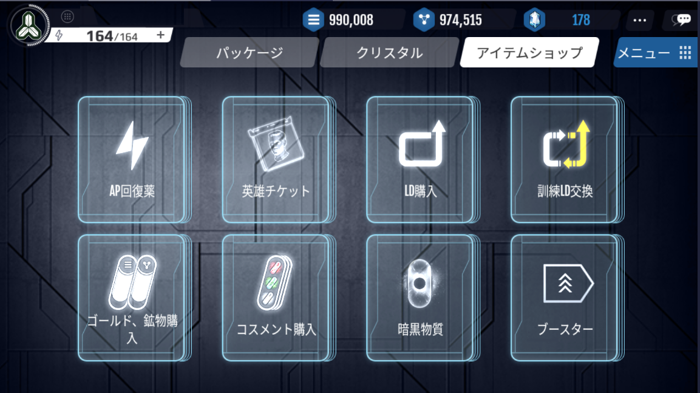
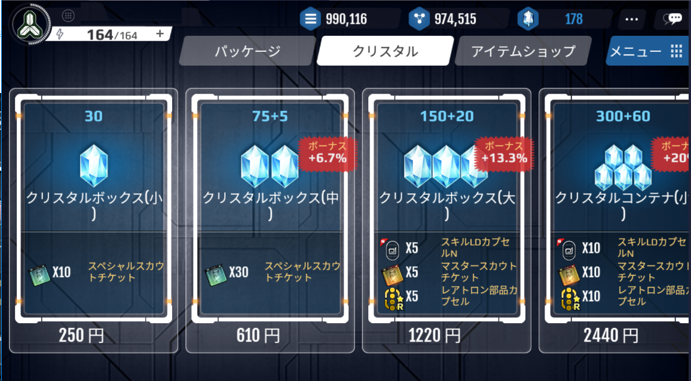
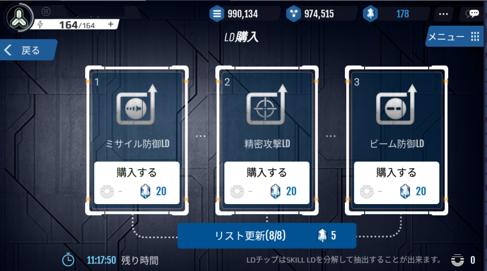

# ショップ

ショップでは、クリスタルを使用してアイテムを購入することや、クリスタルを購入することができます。

・AP回復薬

・英雄チケット

・ゴールド・鉱物

・コスメント

・ブースター

・シールド

をクリスタルを使用して購入することができます。

# クリスタル

クリスタルボックス・クリスタルコンテナを購入することができます。

# LD交換所

・LD購入

LDチップとクリスタルを使用して、スキルLDを入手することができます。

このリストは每日更新されますが、クリスタルを使用することですぐに更新することもできます。

・訓練LD交換

一般訓練LD10個 → 高級訓練LD1個

高級訓練LD1個 → 一般訓練LD5個

に交換することができます。