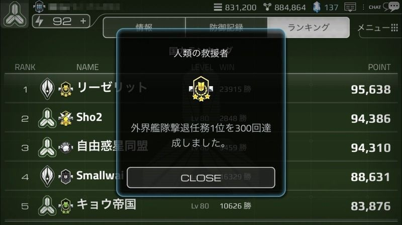

# 称号システム

# 称号とは

特定の条件を満たすと、称号を獲得することができます。

称号はあくまで勲章であるため、称号によって特殊スキルが発生することはありません。

称号を設定すると、戦闘リストや友人リスト、ランキングなどのプレイヤーの国家名が表示される場所に、常時掲示されます。

それぞれの称号毎に獲得条件は様々あり、称号獲得時には報酬としてクリスタルが獲得できます。

# 称号の確認方法

[情報]メニューから、ユーザーの称号を設定することができます。

「現在の称号」には設定中の称号が表示されており、「称号管理」ボタンをタップすると、ユーザーが保有している称号の一覧を確認することができます。

取得していない称号もリストに登場し、その称号アイコンをタップすると、獲得条件が表示されます。

称号には、獲得方法が公開されている称号とそうでない秘密の称号があります。

同盟や敵国家の称号も、称号アイコンをタップすると、その情報を確認することができます。

未獲得の称号をタップすると、獲得するための条件が表示されます。

所属連合マークと相手国家名の間に称号が表示され、アイコンをタップすると、称号の説明が表示されます。