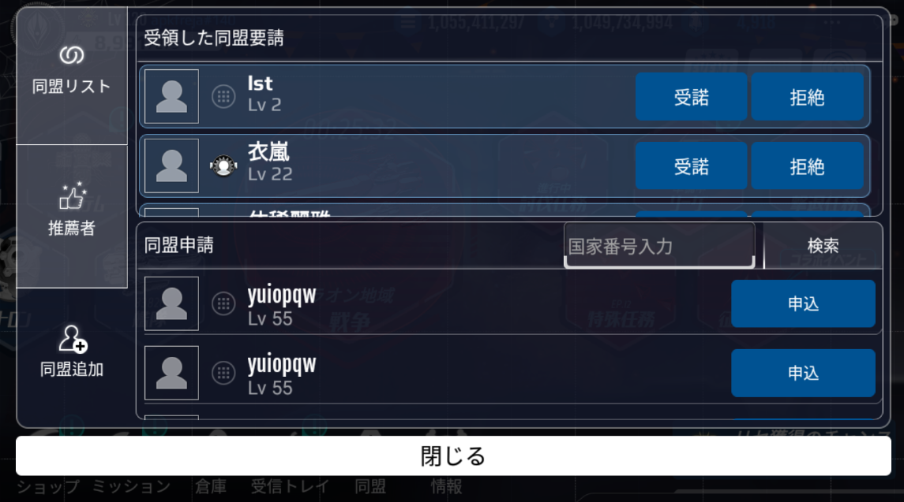
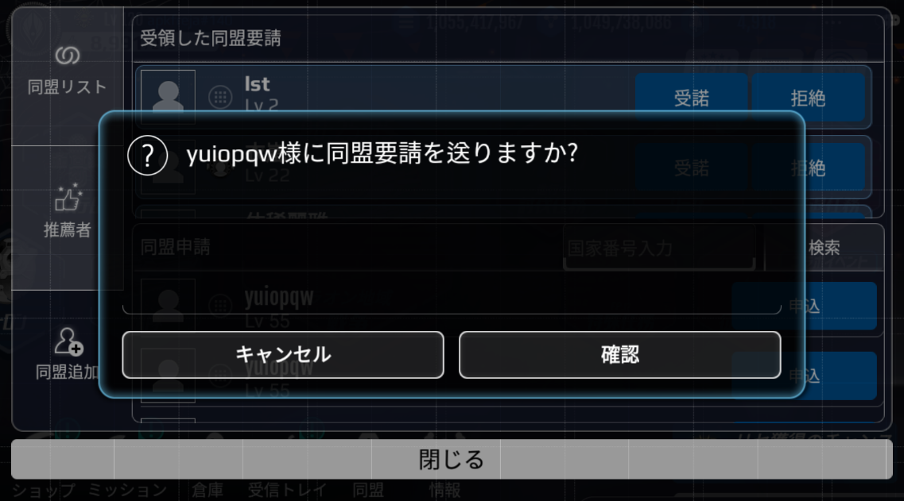
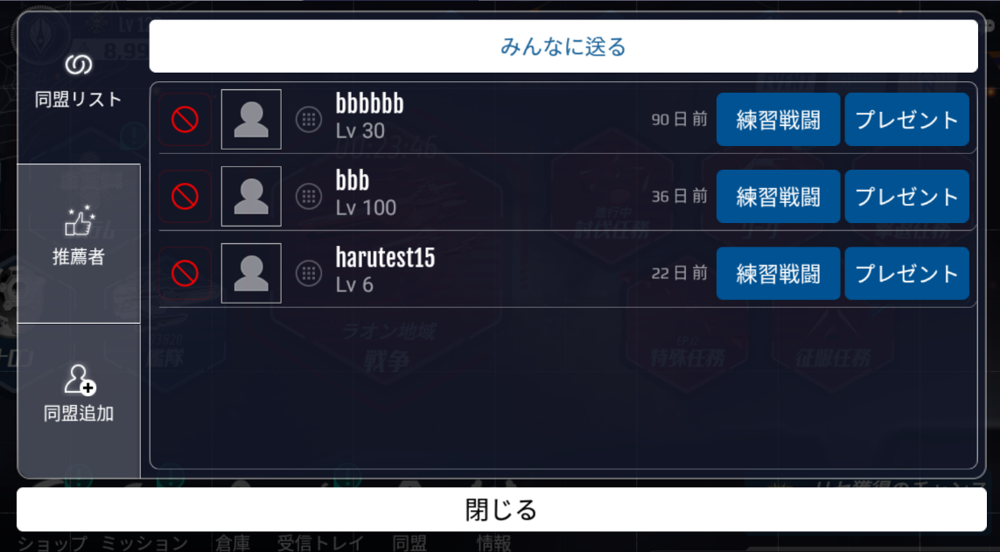
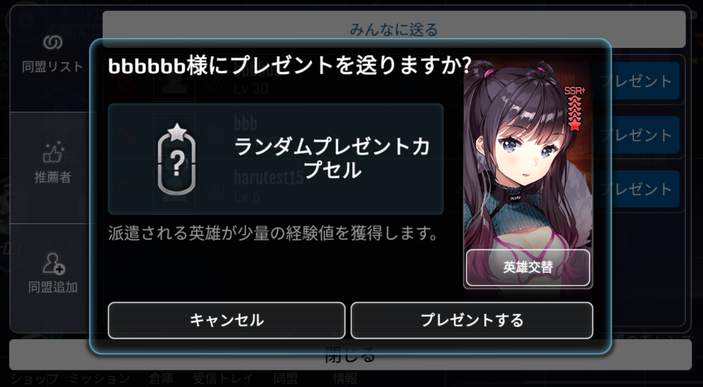
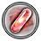
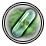
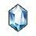
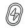
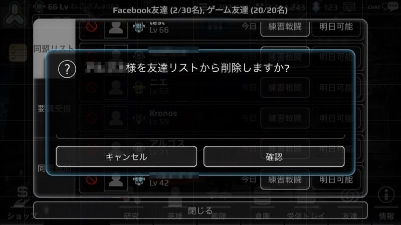
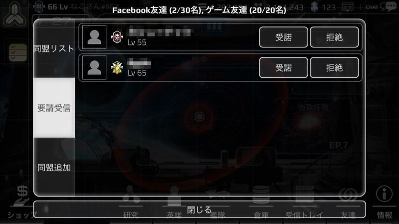

# 同盟システム

# 同盟
同盟とは、ゲーム上の友達のことです。

同盟は、同じ連合でなくても(敵陣営とも)結ぶことができます。

同盟を結んだ友達に「プレゼント」を送信することや「練習戦闘」を行うことで、報酬を受け取ることができます。

Facebookのアカウントを利用して、Facebook上のリアルの友達と同盟を組むこともできます。

# 同盟追加

同盟の追加は、同盟メニューの同盟追加リスト画面から行うことができます。

同盟追加リストには、同盟を申し込むことができるユーザーのリストが表示されます。

様々なユーザーがランダムに登場し、レベル・ユーザ名・使用している称号を確認することができます。

希望するユーザーリストの「申込」ボタンを押すことで、同盟申請を完了することができます。

※Facebook上の友人と同盟を組むには

『アストロ娘』にFacebookアカウントでログインすると「同盟追加」画面にて、友人のアカウントが表示されますので、そこから「申込」をします。

（該当ユーザーは、Facebookの登録名とプロフィールアイコンが表示されています）

同盟は、

・ゲーム上の友達…20名まで

・Facebook上の友達…30名まで

登録可能で、今後のアップデートなどで変更されることがあります。

# プレゼント

同盟を結んだ友人にプレゼントを贈る機能があります。

同盟に「ランダムプレゼントカプセル」を贈ると、自分が指定した英雄の経験値を獲得することができます。

同盟からもらったプレゼントは受信トレイから確認可能で、アイテムは倉庫などから使用可能です。

同盟からもらえるランダムカプセルの中身は様々な種類があり、その内の一つがユーザの手元に届きます。

[ランダムプレゼントカプセルのアイテムリスト]

|アイコン|名前|	数量|
|---|---|---|
||ゴールド|20,000|
||ゴールド|100,000|
||鉱物|10,000|
||鉱物|50,000|
||ラオン|100|
||セクチュム|100|
||ニューゼン|100|
||ラオン|500|
||セクチュム|500|
||ニューゼン|500|
||クリスタル|2|
||AP回復薬|1|
||英雄チケット|1|
||一般職業LD|1|
||ニB等級惑星発見チケット|1|

# 同盟の管理

同盟メニューで同盟を管理することができます。

同盟リスト画面において、友達リストの[X]ボタンを使用すると、同盟を破棄することができます。

破棄された同盟は、今後同盟リストに登場しません。

同盟は、同盟の申請を受諾することで増やすことができます。

「要請受信」画面では他のユーザーから送られてきた要請一覧を確認することができ、「受諾」または「拒絶」することにより同盟を結成するかどうかを決定することができます。

[同盟管理]

# 練習戦闘
同盟を結んだ友達と、1日につき1回のみ練習戦闘をすることができます。

練習戦闘は、通常の戦闘とは異なり、ゴールド、鉱物、コスメント、経験値は獲得できません。

練習戦闘では、例え負けたとしても艦体は破損せず、勝敗に関係なくアイテムを獲得できます。

[練習戦闘で獲得可能なアイテム]

|アイテム名|	効果|
|---|---|              
|ゴールドカプセル（小）|約2万ゴールド＋αを得ることができます|
|ゴールドカプセル（中）|約20万ゴールド＋αを得ることができます|
|ゴールドカプセル（大）|約200万ゴールド＋αを得ることができます|
|鉱物カプセル（小）|約1万鉱物＋αを得ることができます|
|鉱物カプセル（中）|約10万鉱物＋αを得ることができます|
|鉱物カプセル（大）|約100万鉱物＋αを得ることができます|
|コスメントカプセル（小）|約400個＋αのコスメント(ラオン・セクチュム・ニューゼンのどれか)を得ることができます|
|コスメントカプセル（中）|約2000個＋αのコスメント(ラオン・セクチュム・ニューゼンのどれか)を得ることができます|
|コスメントカプセル（大）|約1万個＋αのコスメント(ラオン・セクチュム・ニューゼンのどれか)を得ることができます|
|英雄チケット|N～Rランクの英雄を招待できるアイテムです |
|高級英雄チケット|R～SRランクの英雄を招待できるアイテムです|
|一般訓練LD	|英雄の能力を向上させる訓練情報が含まれているディスクです。英雄の能力の訓練時に使用します|
|高級訓練LD	|英雄の能力を向上させる高級訓練情報が含まれているディスクです。英雄の能力の訓練時に使用します|
|ゴールドブースター12H|12時間の間、ゴールド収入が100％増加します（既に使用されている場合は、期間が延長されます）|
|鉱物ブースター12H|12時間の間、鉱物収入が100％増加します（既に使用されている場合は、期間が延長されます）|
|経験値ブースター2H|2時間の間、英雄が経験値を2倍獲得します（既に使用されている場合は、期間が延長されます）|
|貢献度ブースター2H|2時間の間、戦争貢献度を2倍獲得します（既に使用されている場合は、期間が延長されます）|
|攻撃ブースター2H|2時間の間すべての艦体の攻撃力が50％増加します（既に使用されている場合は、期間が延長されます）|
|防御ブースター12H|12時間の間すべての艦体の耐久度が50％増加します（既に使用されている場合は、期間が延長されます|
