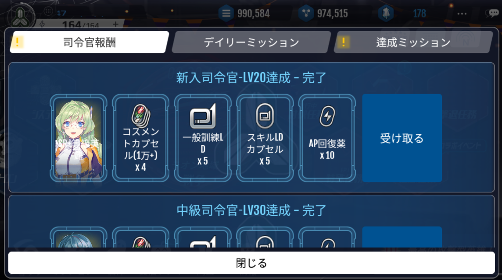
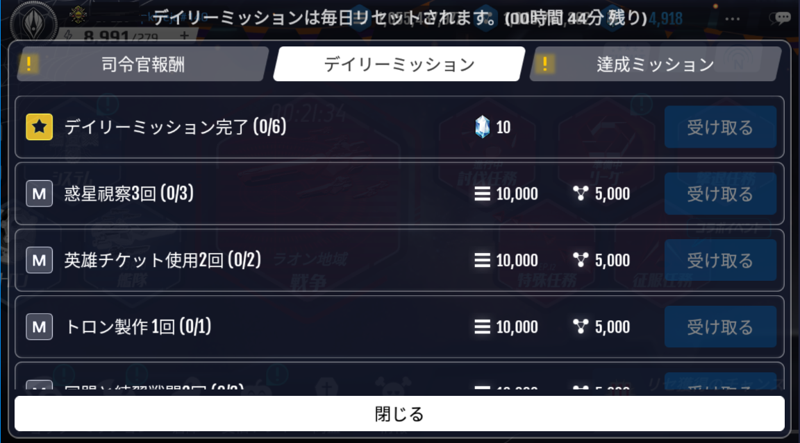
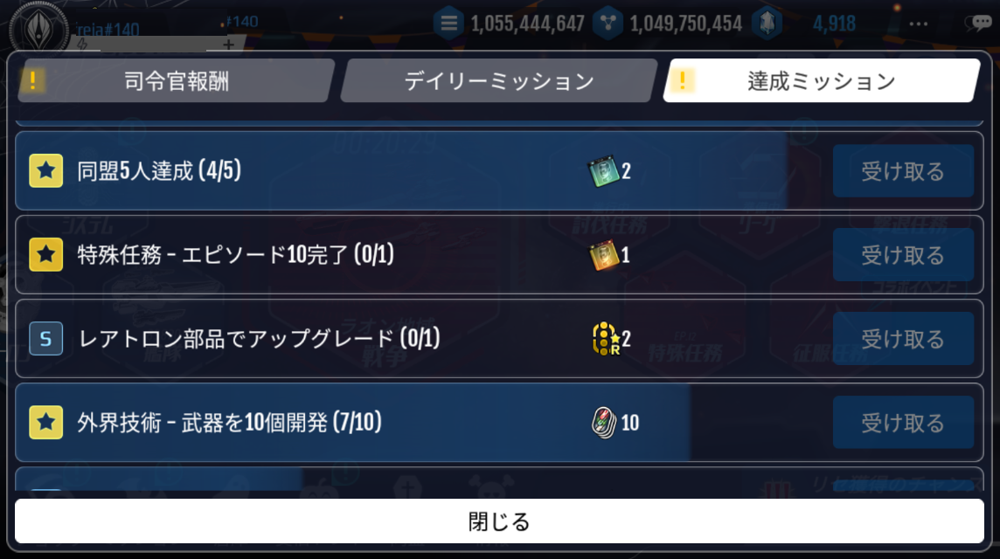

# 司令官報酬

司令官報酬は、一定の国家レベルに達成する毎に獲得できる報酬です。

# デイリーミッション

デイリーミッションは、毎日リセットされる繰り返し型のミッションです。

デイリーミッションを全て達成すると、10クリスタルを報酬として獲得することができます。

# 達成ミッション

達成ミッションは、国家レベルや特殊任務、惑星の施設レベルなどの進行度合いによって報酬が得られる段階型ミッションです。

ミッションを達成し報酬を獲得すると、さらにレベルが高いミッションが設定されます。

