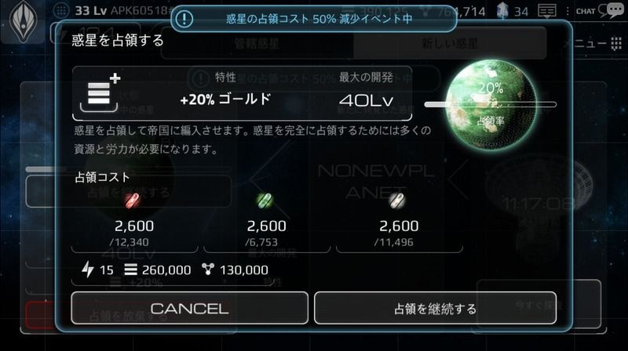
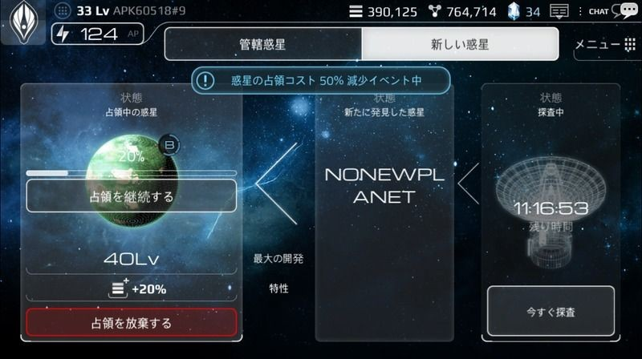

# 惑星探査

ゲーム開始時点では、ユーザーは惑星を1つ保有しています。
国家レベルが20以上になると、「惑星探査」および「占領」を開始することができます。

「惑星探査」は、「惑星」メニューの「新しい惑星」から実行できます。
「惑星探査」は、24時間毎に新しい惑星を自動的に発見します。
「惑星探査」で発見できる惑星の最大レベル・等級・環境は、ランダムに決定されます。

発見した惑星は、占領を完了することにより、ユーザーの保有惑星となります。
占領中でない惑星は、
・24時間経過する
・10クリスタルを使用して、新しい惑星を発見する
・惑星発見チケットを使用する
上記のいずれかが実行されると、消滅します。

惑星発見と占領

 

# 今すぐ探査
10クリスタルを使用して、C～Sランクの惑星をただちに発見できます。
24時間毎に更新される「惑星探査」に比べて、高確率でレアな惑星を発見できます。

「今すぐ探査」を実行後、「惑星探査」の残り時間がリセットされ、次の「惑星探査」は24時間になります。
「今すぐ探査」で発見された惑星も、占領を実行しなければ24時間後に「惑星探査」が行われ、他の惑星に更新されます。
「今すぐ探査」を実行すると、「新しい惑星」画面で現在発見されている惑星は消滅します。

# 惑星発見チケット

惑星発見チケットを使用すると、チケットに記載されている等級の惑星をただちに発見できます。
惑星発見チケットは「倉庫」より確認・使用でき、発見した惑星は「惑星」→「新しい惑星」で確認できます。
惑星発見チケットを使用して発見した惑星も、占領を完了することにより、ユーザの保有惑星となります。
惑星発見チケットを使用した後に、「今すぐ探査」や「惑星探査」が実行された場合、惑星発見チケットで発見した惑星は消滅します。

| 画像 |名前 | 効果 | 獲得方法 |
| --- | --- | --- | --- |
| | B等級惑星発見チケット | 新しいB等級惑星をただちに発見します | 同盟から送られるプレゼント（ランダムカプセル）から一定の確率で獲得可能 |
| | デザート | 砂漠に覆われた黄色の惑星です。エネルギー施設の性能が向上します | 	一般スターターパックに同梱 |
| | ターレイン | 様々な地形で成り立っている、緑色の惑星です。住居施設の性能が向上します | VIPスターターパックに同梱。「名誉物資支援所」のレアアイテム交換から一定の確率で獲得可能 |

※ほかにも「パラダイス惑星」が確実に発見できる惑星発見チケットがあります（特別イベントにて獲得可能）。

# 惑星占領
惑星の「占領」は、国家を拡大させるための最初の一歩です。
国家レベルが20を超えると、2つ目の惑星を占領できます。
1つの惑星を保有するためには、「占領」を10回実行することが必要です。

保有した惑星には様々な建造物を建設・アップグレードすることができ、それによって資源・収入などを増加させることができます。
ユーザーが保有している惑星の個数が多ければ多いほど、惑星の「占領」費用も増加します。

「占領したい惑星を発見したが、資源が充分には無い」という場合、「占領」を1段階だけ進めて「占領中の惑星」とすることにより、発見した惑星の消滅を防ぐことができます。

[惑星の保有数によって変動する占領費用]

