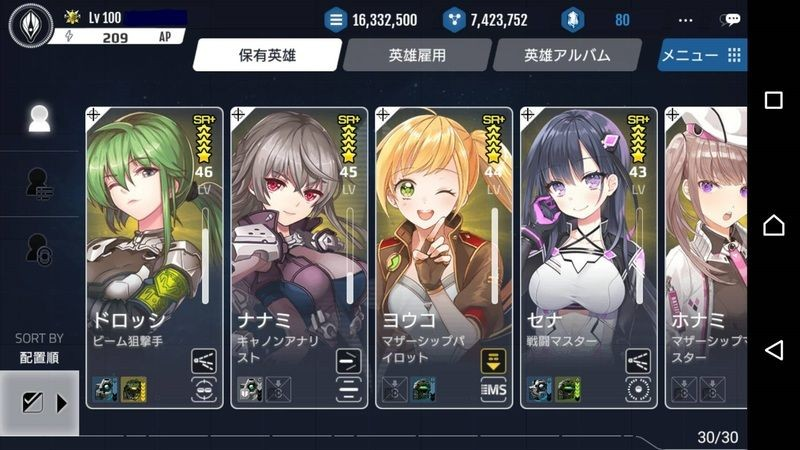

# 英雄概要

# 英雄とは

英雄は、惑星を支配し戦闘を指揮する、国家の運営において核となる存在です。

英雄を惑星長官に任命すれば、英雄の「統治」のステータスや統治関連のスキルによって、

惑星から得ることができる資源、研究力、エネルギー、艦隊生産力にボーナスが加わります。

英雄を艦隊司令官に任命すれば、戦闘に参加できます。

英雄の「攻撃」「防御」「指揮」ステータスは、それぞれ艦隊の攻撃力・防御力・艦隊数に関連します。
英雄の職業とスキルは、戦闘の勝敗に大きな影響を及ぼすことになります。

英雄は初期段階では10人まで保有することができ、クリスタルを使用することで保有枠を拡張することができます。

英雄を雇用する際にはにはゴールドが必要となり、その額は英雄の等級により違います。

英雄リスト画面

| 候補生 | |   |  |   
| --- | --- | --- | --- |
|  |  |  | |

| 武器特化英雄 | |   |  |   |   |
| --- | --- | --- | --- | --- |  --- |
| |  |  | |  |
|  |  |  |  |  |  |

| 艦体特化英雄 | |   |  |   | 
| --- | --- | --- | --- | --- | 
| |  |  |  | |
| |  |  |  |  |
|  |  |  | 

| 惑星長官 | |   |  |   | 
| --- | --- | --- | --- | --- | 
| |  |  |  |  |

# 英雄の等級

英雄は、「N」「R」「R+」「SR」「SR+」「SSR+」のランクで区分されます。

それぞれのランクにより、ステータスの総合値が異なり、高ランクの英雄ほどステータス値は高くなります。

高ランクであるほど、レベルアップ時のステータスの上昇値は大きくなります。

また、高ランクであるほど、訓練LD・スキルLD使用時の能力値の上昇は大きくなります。

「SSR+」の英雄は固有のリーダースキルを保有しています。

[英雄の等級毎の特徴]

| 等級 | 	特徴 | 
| --- | --- | 
|R|	ノーマル英雄です|
| R+| 	レアリティ英雄です| 
| SR| 	職業を持つことができます| 
| SR+| 	スキルを持つことができます| 
| SR+M| 	特化を持つことができます| 
| SSR+| 	固有のリーダースキルを持っています| 

# 保有および限度

ゲーム開始時は、英雄を一人保有した状態でスタートします。

英雄を雇用する際は、費用(ゴールド)が発生します。

初期段階では、英雄は10人まで雇用できます。

10人以上の英雄が必要な場合、クリスタルを使用して拡張スロットを購入する必要があります。

[スロット増加とクリスタル数]

|  | 	 | 
| --- | --- | 
| スロット増|	必要クリスタル|
|10 → 15|	100|
|15 → 20|	150|
|20 → 25|	200|
|25 → 30|	250|
|30 → 35|	300|
|35 → 40|	350|
|40 → 45|	400|
|45 → 50|450|
