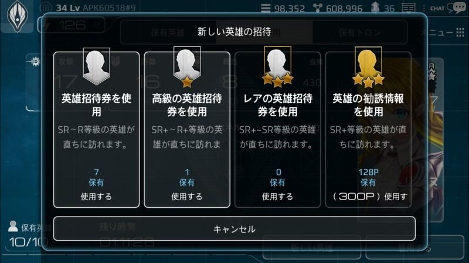

# 英雄の雇用
主にスカウトによって英雄を雇用することができます。

出現した英雄を雇用しなかった場合、その英雄は司令官のもとから去っていきます。

英雄は、ユーザーの国家レベルの70%相当のレベルの状態で訪れます。

例：国家レベルが30の場合、訪れる英雄のレベルは21前後

[英雄雇用画面]

   

# 一般雇用
12時間ごとに、新しい英雄があなたの元にやってきます。

新しくやってきた英雄は、[英雄]→[英雄雇用]画面で確認できます。

訪れてくる英雄は、12時間毎に更新されます。

(12時間経過する前に英雄チケットを使用した場合、雇用待機中の英雄はいなくなります)

主にN～Rランクの英雄が訪れ、かなりレアな確率でR+ランクの英雄がやってくることもあります。

# 英雄チケット
最も低いランクのチケットです。

英雄チケットを使用すると、直ちに英雄を呼ぶことができます。

N～Rランクの英雄が主に訪れ、時折R+ランクの英雄がやってくることもあります。

この確率は、自動で英雄が更新される「一般雇用」よりとても高いです。

英雄チケットでショップで購入することができ、同盟からのプレゼントなどゲーム内活動でも獲得できます。

[英雄チケット]

|  | 	 | 
| --- | --- | 
| 英雄チケット1枚|英雄チケット5枚|
|英雄を呼ぶことができるチケット1枚|	英雄を呼ぶことができるチケット5枚|
|購買価格    20クリスタル |	購買価格    60クリスタル 

# 高級英雄チケット
「英雄チケット」よりも1ランク高い英雄チケットです。

主にR+～SRランクの英雄が訪れ、時折SR+ランク英雄がやってくることもあります。

ショップで購入することができ、戦争のランキング報酬やミッションの達成報酬などゲーム内活動でも獲得できます。

[高級英雄チケット]

|  | 	 | 
| --- | --- | 
| 高級英雄チケット1枚|高級英雄チケット5枚|
|高級英雄を呼ぶことができるチケット1枚。|	高級英雄を呼ぶことができるチケット5枚。|
|購買価格    120クリスタル |	購買価格    360クリスタル 

# レア英雄チケット
最もレアリティが高い英雄チケットです。

使用すると、直ちにSR～SR+ランクの英雄が訪れてきます。

主にSRランクの英雄が、そしてかなり高い確率でSR+ランクの英雄がやってきます。

ただし、運が悪いとRランクの英雄がやってくることもあります。

特別なイベントや期間限定販売アイテムなどから獲得できます。

[レア英雄チケット]

|  | 	 | 
| --- | --- | 
| 高級英雄チケット1枚|高級英雄チケット5枚|
|高級英雄を呼ぶことができるチケット1枚。|	高級英雄を呼ぶことができるチケット5枚。|
|購買価格    200クリスタル |	購買価格    1600クリスタル 
| 最高レアリティの英雄チケット |||
|獲得方法: 特別イベント、ショップ ||

# スカウトポイント
スカウトポイントを利用して、SR+ランク英雄を招待できます。

[英雄雇用]画面に移動後、新しく訪問した英雄を確認すると、2ポイントの英雄ポイントを獲得できます。

（英雄チケット使用時＝2ポイント、高級英雄チケット使用時＝8ポイント、レア英雄エチケット使用時＝40ポイント）

スカウトポイントを300点以上貯めると、そのポイントでSR+ランク英雄を招待することができます。
（使用した分のポイントは差し引かれます）

[英雄の雇用費用]

|英雄等級|  |  |  |  | 
| --- | --- | --- | --- | --- | --- |
|  | 1,000 | 4,000 | 16,000 | 64,000 | 256,000
| 雇用費用(ゴールド) |

# 雇用および解雇
ゴールドを使用し、英雄を雇用することができます。

雇用した英雄は、英雄保有スロットで確認でき、惑星長官や艦隊の艦長に任命できます。

ゲームは、1人の英雄を保有した状態で始まり、最初は最大で10人の英雄を保有できます。

10人以上の英雄が必要な場合、クリスタルを使用することで英雄保有スロットを拡張できます。

英雄は解雇することもできますが、解雇された英雄は二度とあなたのところに帰ってきません。

英雄を解雇しても、英雄が装備していたトロン装置はそのまま手元に残ります。
