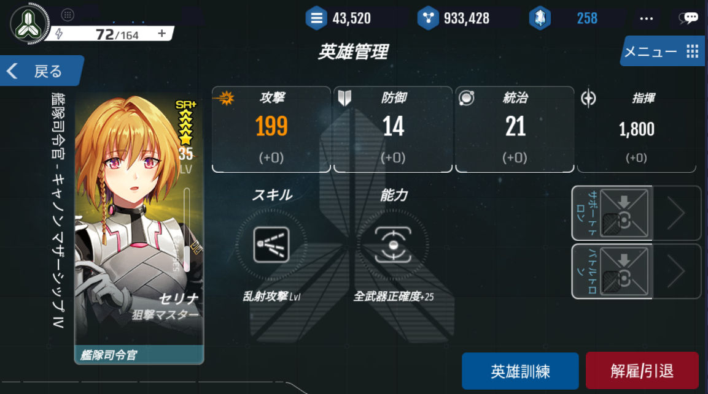

# 英雄の能力

英雄は、4つの基本能力値と「スキル」を保有しています。

基本能力値と職業スキルは英雄の等級によって変わり、戦闘と訓練を通じて成長することができます。

お気に入りの英雄を育成することが、国家育成・繁栄のためのポイントです。

英雄管理画面で英雄の能力を確認できます

# 能力値

全ての英雄は、「攻撃」「防御」「統治」「指揮」能力を保有しています。

艦長として英雄を配置すると、艦隊は英雄の「攻撃」「防御」ステータスの影響を受けることになります。

「指揮」は、英雄が指揮できる艦隊数を意味します。

惑星長官として英雄を配置すると、惑星にある建物の生産力は、英雄の「統治」ステータスの影響を受けることになります。

英雄のステータスの総合値は、英雄のランクによって異なります。

より高いランクの英雄ほど、ステータスの総合値は高くなります。

英雄は、ランダムでステータス値が振り分けられます。

英雄は経験値を得ることによって成長することができ、それに伴いステータス値も増加します。

# スキル
英雄は、SRランク以上からスキルを保有できます。

スキルには、「攻撃」「防御」「統治」スキルがあり、保有できるスキルは、一人につき一つです。

英雄のスキルは、ランダムに付与され、変更はできません。

高ランクの英雄のみ持てるスキルもあります。

LDを使用することでスキルのレベルを上げることができ、それに伴いスキル効果も上昇します。

# 職業
R+以上の英雄には、「職業」があります。

1人の英雄につき1つの職業が割り当てられており、それぞれの職業には「能力」が付随しています。

英雄の「職業」はランダムに付与され、後で自分で変更することができません。

一部の職業は高いランクの英雄だけが持つことができます。

訓練LDを使用し、職業レベルを上げると職業能力も向上します。

# 特化
SR+ランクの英雄だけが、「特化」を持つことができます。

特化は英雄のイメージ画像で黄色で表示されます。

特化はステータス、スキル、職業の効果を永続的に強化します。

ステータスに特化が適用されると、その英雄は通常のステータス値よりさらに高いステータス値を保有することになります。

特化されたステータスは、レベルアップ時に大きく成長します。

スキルに特化が適用されるとさらに高いスキル能力に、職業に特化が適用されるとさらに高い職業能力になります。

[職業特化]

| | | |
| --- | --- | --- | 
|攻撃特化| 攻撃+10 + (英雄レベル-1) | レベルアップ時+1 ステータスをさらに受け取る
|防御特化|	防御+10 + (英雄レベル-1)|レベアップ時+1ステータスをさらに受け取る|
|統治特化|	統治+10 + (英雄レベル-1)|	レベルアップ時+1ステータスをさらに受け取る|
|指揮特化|	指揮力20%	レベルアップ時+20%さらに受け取る|
|職業特化|	職業能力+20 (or 20%)	|
|スキル特化|	スキルレベル+2|