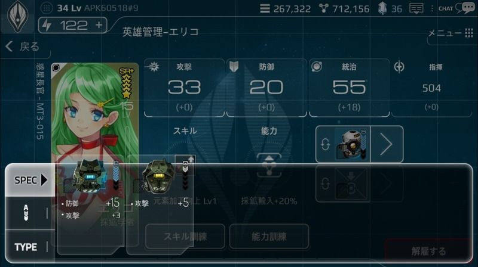
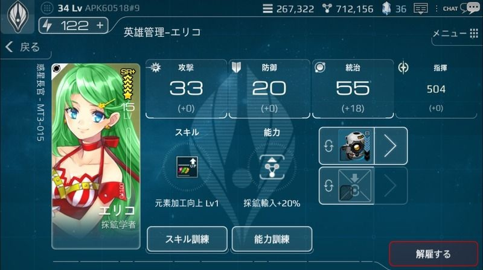

# トロンシステム

# トロン概要
トロンは、英雄をサポートする人工知能ロボットです。

英雄は、戦闘型トロンと補助型トロンの各1体ずつを装着でき、いつでも変更することができます。

戦闘型トロン…戦闘に関連する英雄の能力値を上昇させます。

補助型トロン…戦闘以外のことに関する英雄の能力値を上昇させます。

トロンにはそれぞれ、類型・等級・レベルによって分類されています。

トロンには、メインとなる性能とオプションの性能を持っています。

トロンのレベルが高いほど、トロンの性能も高くなります。

トロンは部品の組合せによって製作され、使用部品によって効果が異なります。

トロンの部品は、主に「特殊任務」で勝利した報酬として獲得できます。

国家レベルによって保有できるトロンの数が決まっています。

トロンを装着した英雄を解雇した場合、装着していたトロンは保管ボックスに戻ります。

# トロンの等級とレベル
トロンの等級はD～Sの5段階となっており、等級が高いほどオプションの数が増えます。

トロンのレベルは高ければ高いほど、高性能となっています。

トロンの等級とレベルは、組合せに使用した部品の等級と質により変わります。

トロン性能の数値は、該当する等級とレベルの範囲内でランダムに決定されます。

# 組立てと分解
「コア」「オプト」「ピボット」の、３つの部品を組み立ててトロンを製作できます。

ピボットには「戦闘型」と「補助型」のピボットがあり、これによってトロンの類型が決定されます。

トロン部品は、一般部品と高級部品に分かれていて、1～5等級の等級があります。

トロンを組立てる際の部品の質と等級により、出来上がるトロンが異なります。

高級部品を使えば等級が高いトロンが製作される確率が上がり、トロンのレベルにも影響を及ぼします。

トロン製作時には、費用としてゴールドが必要になり、高等部品で組み立てるほどその費用は高額になります。

製作されたトロンを分解すると、鉱物を獲得することができ、等級が高いほどより多くの鉱物を獲得できます。

# 装着と解除
トロンは、「英雄」画面で脱着できます。
英雄の空スロットをタップすると、装着できるトロン一覧が表示されます。
トロン装着後、リスト外の項目をタップすると英雄画面に戻ります。

英雄はトロン類型(補助・戦闘)によりそれぞれ1体ずつトロンを装着できます。
トロンは装備の解除が可能で、他の英雄にも装着できます。
英雄はレベル、等級の制限なしに全てのトロンを装着できます。

[トロン装着画面]

 