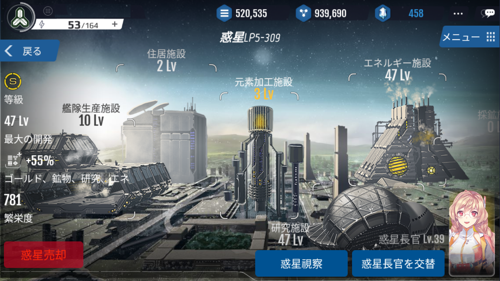
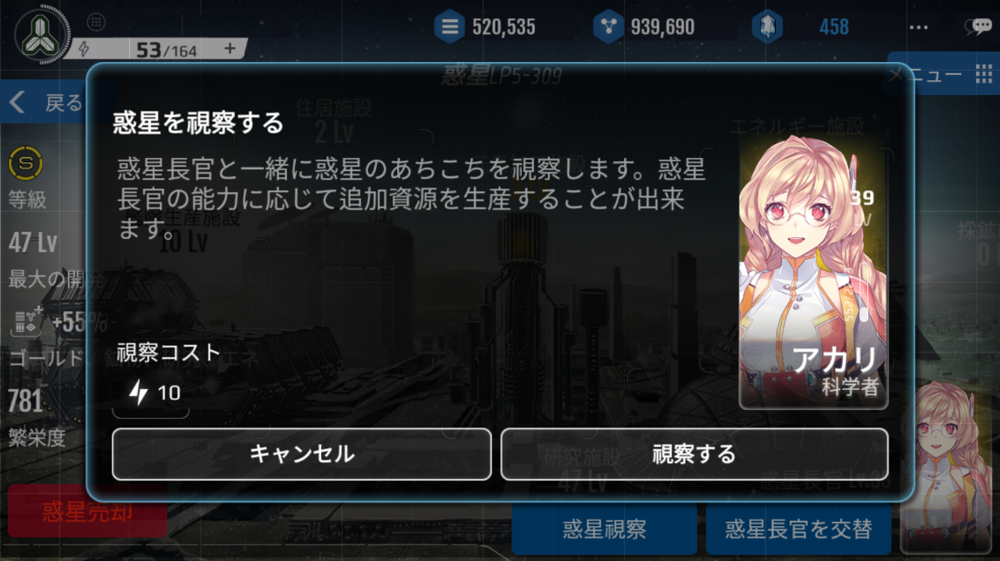
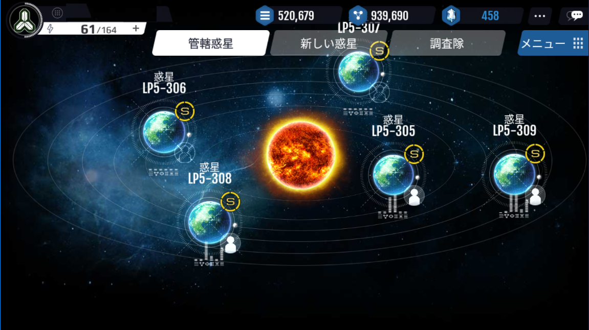
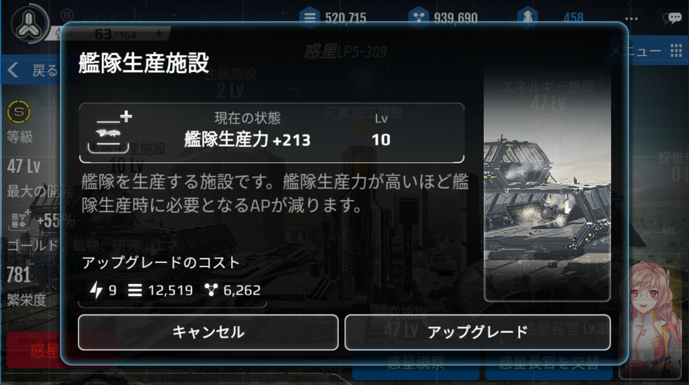
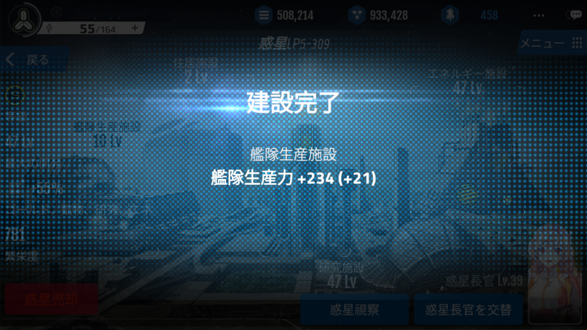

# 惑星管理

# 惑星長官任命
英雄を惑星長官に任命することで、惑星に建設された施設の効率を上げることができます。

惑星長官に任命された英雄は、「統治」能力の値に比例して惑星全体の資源生産効率を上げられます。

惑星長官の「統治」能力値1につき、惑星内の全ての施設の性能が+2%ずつ上昇します。

惑星長官に任命された英雄の職業能力によって、特定の施設の性能を向上させます。

 

# 英雄職業能力
| 職業名 | 	能力 |
| --- | --- |
|経済学者| 住居施設のゴールド収入向上 |
|鉱物学者| 	採鉱施設の鉱物収入向上|
|エネルギー学者| エネルギー施設の最大エネルギー向上 |
|科学者|研究施設の研究力向上|
|工学者|艦隊生産施設の艦隊生産力向上|

# 惑星視察
惑星長官は、10APを消費して「惑星視察」をすることによって、資源を追加で生産することができます。

惑星視察では、
ゴールド、鉱物、ラオン、セクテュム、ニューゼン
の内、1種類の資源が追加生産されます。

ゴールド・鉱物…現在の収入量の15倍 or 30倍の追加生産
ラオン・セクチュム、ニューゼン…100個 or 200個の追加生産

資源の追加生産が終了後、25%の確率でさらに追加アイテムを獲得できます。

[惑星視察で取得できる追加アイテム]
・ゴールドカプセル(小、中、大)のうち1個
・鉱物カプセル(小、中、大)のうち１個
・ラオンカプセル(小、中、大)のうち1個
・セクテュムカプセル(小、中、大)のうち１個
・ニューゼンカプセル(小、中、大)のうち１個
・一般英雄チケット
・高級英雄チケット
・一般訓練LD
・高級訓練LD
・ゴールド ブースター(12時間)
・鉱物ブースター(12時間)
・経験値ブースター(2時間)
・貢献度ブースター(2時間)
・防御ブースター(12時間)

惑星視察終了後、惑星長官の経験値と国家の経験値が獲得できます。

# 施設建設・アップグレード
保有している惑星の施設は、アップグレードすることができます。

施設がアップグレードされれば、施設の効果が上昇します。

施設のレベルが上がる毎に、アップグレードにかかる費用(ゴールド、鉱物、AP)も増加します。

施設のアップグレードにかかる詳細な数値などは、惑星施設のページをご確認してください。

| 施設名 | 	施設の説明 |
| --- | --- |
|元素加工施設| 戦争で勝利した地域からコスメントを運搬後、加工して精製する施設です |
|住居施設| 住民たちが居住する施設です。住民たちから得られる税金は、国家の運営に必要不可欠な資金となります|
|採鉱施設| 艦体生産や、施設の建設などに必要な鉱物を生産する施設です |
|研究施設|科学を研究する施設です。 科学技術を研究するためには十分な研究力が必要です|
|艦隊生産施設|艦体を生産する施設です。 艦体生産力が高いほど、艦体生産時に必要なAP量が減少します|
|エネルギー施設|艦体を維持するのに必要なエネルギーを供給する施設です|

# 惑星売却
保有している惑星を売却する時に使用する機能です。

惑星を売却すると、惑星の占領にかかったゴールド・鉱物・コスメントの50%が還元されます。
惑星長官に任命されていた英雄は、待機状態に戻ります。

保有惑星が減ると、国家を運営するのに必要な資源…ゴールド・鉱物・コスメントの生産量、研究力、艦隊生産力、エネルギー量などが減少します。

また、一度売却した惑星の復旧はできません。