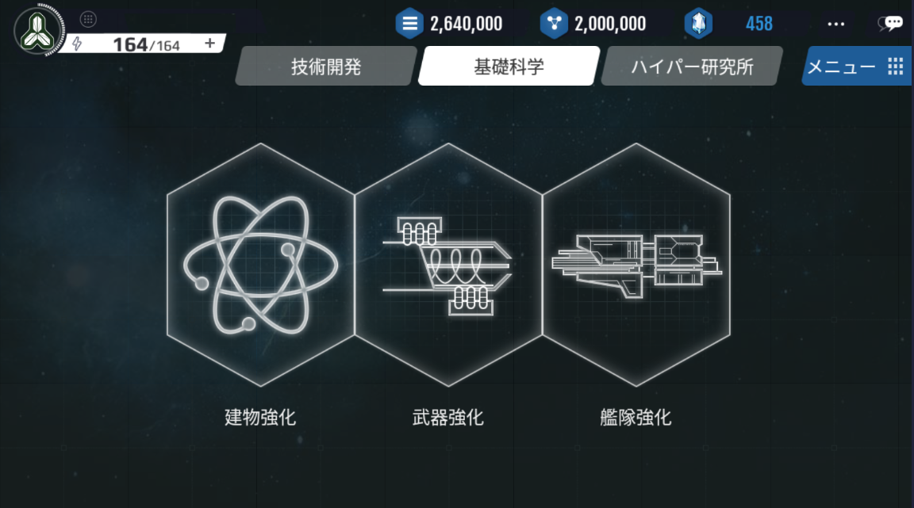
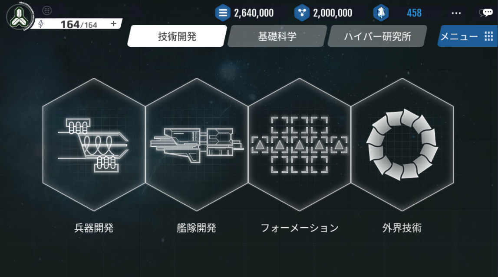

# 研究概要

# 研究とは
研究により、ユーザーは新しい艦船や武器を開発することができます。

研究は大きく7つの項目に分けられ、項目やレベルによって、それぞれ要求される研究力の数値が決まっています。

研究の目的は、ユーザーが他の国家との戦争で生き残るようにすることです。

研究は、「基礎科学」「技術開発」さらに最上位コンテンツである「ハイパー研究」の三つのタイプに分かれています。

基礎科学は、国全体の効率化と施設の性能の向上に重点を置いた項目であり、

技術開発は、研究終了後に使用できる武器、艦隊、設備などに関係があります。

そしてハイパー研究は、既存の技術を進化させたハイパー技術による開発を実行する事が可能です。

# 基礎科学
基礎科学は、「建物」「武器」「艦隊」の性能を向上させる研究です。

各項目を研究することにより、施設や武器、艦船の性能を向上させることができます。

基礎科学は、最大50LVまでの研究が可能です。

# 技術開発

# 兵器開発

兵器開発では、4種類の兵器（ビーム・ミサイル・戦闘艇・キャノン）を開発できます。

新たな武器の研究開発には、一定の研究力とコスメント・ゴールド・鉱物を必要とします。

# 艦隊開発
艦隊開発では、4種類の船（デストロイヤー、クルーザー、バトルシップ、マザーシップ）を開発できます。

新たな艦隊の研究には、一定の研究力とコスメント・ゴールド・鉱物を必要とします。

艦隊開発項目では、艦船の武器を強化し、欠点を補完できる「特殊装置」の研究も可能です。

# フォーメーション

フォーメーション開発では、9種類の陣形を開発できます。

各フォーメーションはそれぞれ長所と短所があり、研究する際は一定の研究力を必要とします。

# 外界技術
外界技術は、外界艦隊を撃退時に一定の確率で獲得できる特殊なキューブを使用して研究することが可能です。

外界技術は、「武器」と「特殊装置」で構成されており、特定の状況下において非常に優れた性能を発揮します。

研究のためには、キューブと大量のコスメント、そして外界艦隊から得られる暗黒物質が必要です。

