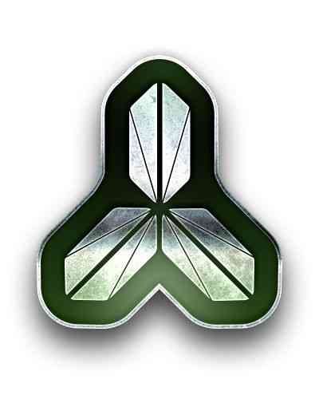
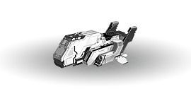
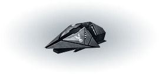
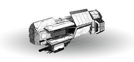
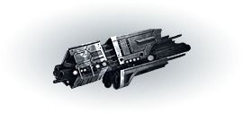
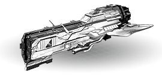
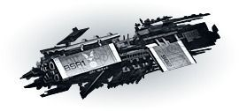
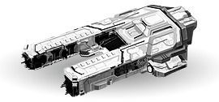
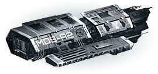

# 艦隊概要

# 艦隊とは
艦隊は、敵陣営の侵略から守るだけでなく、敵陣営を攻撃する際にも使用します。

艦隊が不足したままだと、敵陣営からの侵略を防ぐことができないため、常に多くの艦隊を維持できるようにしなくてはなりません。

# 艦隊の種類
艦隊の種類は、合計で4種類あります。

艦隊は「研究」を深めることによって、より上位のモデルを開発することができます。

ゲーム序盤では、「デストロイヤー」の製作と運用が可能となっており、研究開発を進めていくことで「クルーザー」、「バトルシップ」、「マザーシップ」の製作と運用が可能になります。

[デストロイヤー]

| | |
| --- | --- |
|   テラ連盟 |  ネオス連合  |
||  |

デストロイヤーは速度が速いため回避力が高く、序盤の主力艦隊として活用できます。
中盤以降もその高い回避力を活かして、戦争を有利に進められる艦隊です。

[クルーザー]

| | |
| --- | --- |
|   テラ連盟 |  ネオス連合 |
||  |

クルーザーはバランスの取れた艦隊で、ゲーム中盤では主力艦隊として活用できます。
特別な弱点がない艦隊です。

[バトルシップ]

| | |
| --- | --- |
|  テラ連盟 |  ネオス連合 |
|!| ! |

バトルシップは強力な攻撃力を持つ艦隊で、ゲーム後半で主力艦隊として活用できます。
攻撃力は強大ですが、マザーシップよりは耐久力が低いです。

[マザーシップ]

| | |
| --- | --- |
|  テラ連盟 |  ネオス連合 |
|!| ! |

マザーシップは高い耐久力と攻撃力を持つ艦隊で、ゲーム後半に主力艦隊として活用できます。
運用コストが高いため、大規模編成には向いていません。

# 艦隊運用
国家レベルが上がるほど、艦隊スロットで編成できる艦隊数が増加します。

初期状態：2つの艦隊運用が可能

レベル10以降：3つの艦隊運用が可能

レベル15以降：4つの艦隊運用が可能

レベル20以降：5つの艦隊運用が可能（最大値）

# 艦隊のエネルギー
艦隊を維持するためには、エネルギー資源が必要になります。

国家の総エネルギー量に比例して、運用できる艦隊の数が決定されます。

艦隊維持に消費されたエネルギーは全て消滅するということはなく、艦隊が破壊された際には消費エネルギーは還元されます。

惑星のエネルギー施設をアップグレードしたり、エネルギーの研究を行うことで、エネルギー資源の保有量を増加させることができます。

4種の艦隊は、それぞれ消費されるエネルギー量が異なります。

エネルギー消費量は、艦隊の性能がアップグレードされても増加しません。

