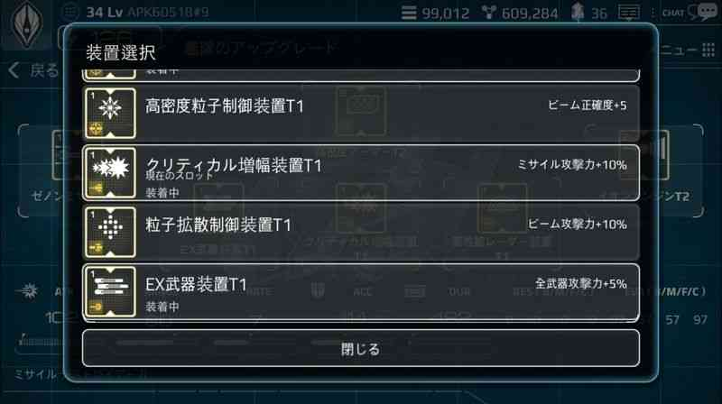

# 部品・アップグレード

# 部品の組み合わせ
艦船は、3つの必要不可欠なパーツ(武器、アーマー、エンジン)と、3つのオプションパーツで構成されてい

武器、アーマー、エンジンは、1つずつ装着が可能です。

艦船の特殊装置は、3種類装着することができ、攻撃力・防御力・回避力を増加させる効果を持っています。

特殊装置は3個まで装着が可能ですが、重複しての装着はできないため、効率良く配置することで艦隊の弱点を補うことが重要になります。

[艦船のパーツ]

# 部品のアップグレード

艦隊の新しいパーツと交換するたびに、アップグレードコストが発生します。

全てのパーツは、アップグレードする際に同額のコストが発生します。

1パーツをアップグレードする際にかかる費用＝

　その艦隊の生産に必要なゴールドと鉱物の5％＋5AP

艦隊数に応じて部品のアップグレード費用は自動的に変更されます。