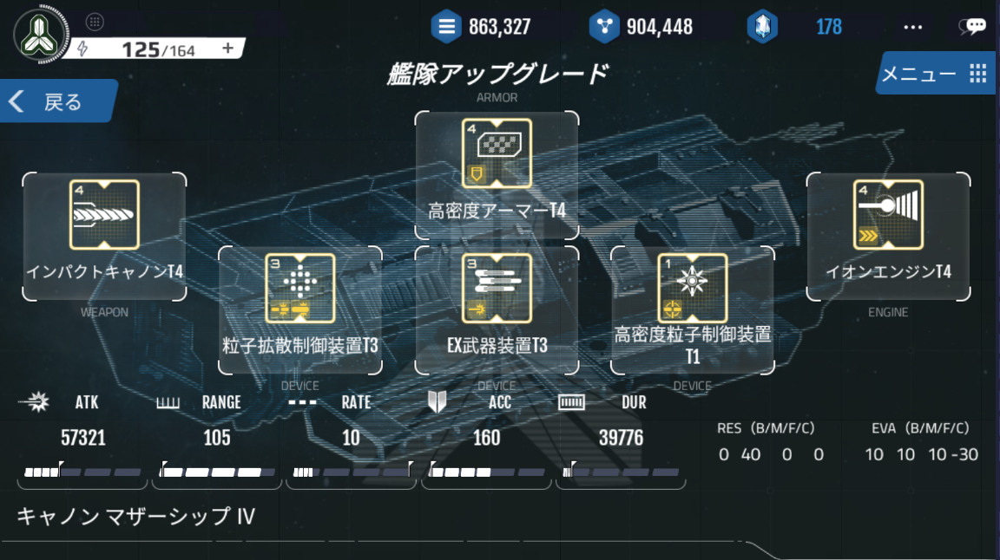

# 生産・廃棄

# 艦隊の構成
艦船は、3つの必要不可欠なパーツと3つのオプションパーツの組み合わせで構成されています。

戦艦を構成するパーツは、武器、アーマー、エンジン部品の3つで、1つでも欠けたら艦船を構成することができません。

基本的には、「武器」「アーマー」「エンジン」パーツを装着した後に、「特殊装置」パーツを装着することができます。

「特殊装置」は全部で3つ装着することができ、同じ装置を重複して装着することはできません。

「特殊装置」は装着しなくても艦船を生産することができ、後で追加して装着したり、変更することができます。

[艦船の構造]

↑6つのパーツで構成されています

# 艦隊生産
艦船は、各等級と種類に応じて生産コストが異なっています。

上位艦隊であるほど生産コストが増加し、消費されるエネルギーも増加します。

下記生産コスト表は、1機の生産に基づいて作成された表です。

艦船の生産コストは、基礎研究や施設の効果によって、表の値よりも減ることがあります。

# デストロイヤー
 

[デストロイヤー生産コスト]

| 等級 | ゴールド| 鉱物 | AP | エネルギー |
| --- | --- | --- |--- | --- |
|デストロイヤーⅠ |84|63|1|10|
|デストロイヤーⅡ|109|82|1|14|
|デストロイヤーⅢ|142|107|1|20|
|デストロイヤーⅣ|185|139|1|28|
|デストロイヤーⅤ|241|181|1|39|
|デストロイヤー ⅤI|313|235|1|55|
|デストロイヤー ⅤII|407|306|1|77|
|デストロイヤー ⅤIII|529|394|1|108|

# クルーザー
 

[クルーザー生産コスト]

| 等級 | ゴールド| 鉱物 | AP | エネルギー |
| --- | --- | --- |--- | --- |
|クルーザー Ⅰ|525|394|5|75
|クルーザー Ⅱ| 683 | 512 |5|105
|クルーザー Ⅲ| 888 | 666 |5|147
|クルーザー Ⅳ| 1154 | 866 |5|206
|クルーザー Ⅴ| 1500 | 1126 |5|288
|クルーザー ⅤI| 1950 | 1464 |5|403
|クルーザー ⅤII| 2535 | 1903 |5|564
|クルーザー ⅤIII| 3296 | 2474 |5|790

# バトルシップ

 

[バトルシップ生産コスト]

| 等級 | ゴールド| 鉱物 | AP | エネルギー |
| --- | --- | --- |--- | --- |
|バトルシップ Ⅰ|1890|1418|15|300|
|バトルシップ Ⅱ|2457|1843|15|420|
|バトルシップ Ⅲ|3194|2396|15|588|
|バトルシップ Ⅳ|4152|3115|15|823|
|バトルシップ Ⅴ|5398|4050|15|1152|
|バトルシップ ⅤI|7017|5265|15|1613|
|バトルシップ ⅤII|9122|6845|15|2258|
|バトルシップ ⅤIII|11859|8899|15|3161|

# マザーシップ
 

[マザーシップ生産コスト]

| 等級 | ゴールド| 鉱物 | AP | エネルギー |
| --- | --- | --- |--- | --- |
|マザーシップ Ⅰ|5880|4410|40|1000
|マザーシップ Ⅱ|7644|5733|40|1400
|マザーシップ Ⅲ|9937|7453|40|1960
|マザーシップ Ⅳ|12918|9689|40|2744
|マザーシップ Ⅴ|16793|12596|40|3842
|マザーシップ ⅤI|21831|16375|40|5379
|マザーシップ ⅤII|28380|21288|40|7531
|マザーシップ ⅤIII|36894|27674|40|10543

# 艦隊廃棄
新しい艦隊を構築するために、既に保有している艦隊を廃棄することができます。

艦隊廃棄時には、対象の艦隊が生産できるコストのゴールドと鉱物の内の80％を回収することができます。

（たとえばその艦隊が、100ゴールド・100鉱物で生産できるものであれば、廃棄時に80ゴールド・80鉱物が戻ってきます）

一度廃棄された艦隊は回復ができないので、慎重に選択する必要があります。