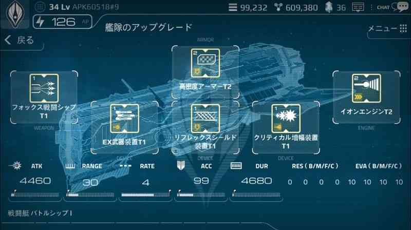
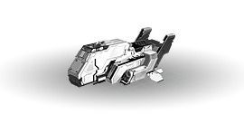
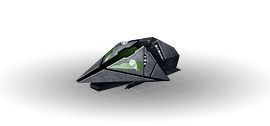
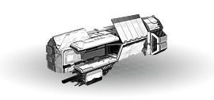
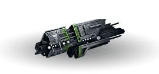
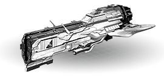
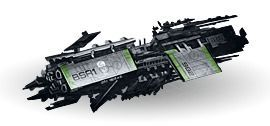
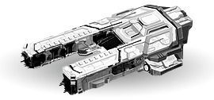
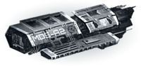

# 生産・廃棄

# 艦隊の構成
艦船は、3つの必要不可欠なパーツと3つのオプションパーツの組み合わせで構成されています。

戦艦を構成するパーツは、武器、アーマー、エンジン部品の3つで、1つでも欠けたら艦船を構成することができません。

基本的には、「武器」「アーマー」「エンジン」パーツを装着した後に、「特殊装置」パーツを装着することができます。

「特殊装置」は全部で3つ装着することができ、同じ装置を重複して装着することはできません。

「特殊装置」は装着しなくても艦船を生産することができ、後で追加して装着したり、変更することができます。

[艦船の構造]

↑6つのパーツで構成されています

# 艦隊生産
艦船は、各等級と種類に応じて生産コストが異なっています。

上位艦隊であるほど生産コストが増加し、消費されるエネルギーも増加します。

下記生産コスト表は、1機の生産に基づいて作成された表です。

艦船の生産コストは、基礎研究や施設の効果によって、表の値よりも減ることがあります。

# デストロイヤー
 

[デストロイヤー生産コスト]

| 等級 | ゴールド| 鉱物 | AP | エネルギー |
| --- | --- | --- |--- | --- |
|デストロイヤーⅠ |112|84|1|10|
|デストロイヤーⅡ|146|109|1|14|
|デストロイヤーⅢ|190|142|1|20|
|デストロイヤーⅣ|247|185|1|28|
|デストロイヤーⅤ|321|241|1|39|

# クルーザー
 

[クルーザー生産コスト]

| 等級 | ゴールド| 鉱物 | AP | エネルギー |
| --- | --- | --- |--- | --- |
|クルーザーⅠ|630|437|5|75|
|クルーザーⅡ|819|615|5|100|
|クルーザーⅢ|1,065|800|5|147|
|クルーザーⅣ|1,385|1.040|5|285|
|クルーザーⅤ|1,801|1,352|5|288|
# バトルシップ

 

[TABLE 03バトルシップ生産コスト]
| 等級 | ゴールド| 鉱物 | AP | エネルギー |
| --- | --- | --- |--- | --- |
|戦艦Ⅰ |2,100|1,575|15|300|
|バトルシップⅡ|	2,730|2,048|15|	420|
|バトルシップⅢ|	3,549|2,662|15|	588|
|バトルシップⅣ|	4,614|3,461|15|	823|
|バトルシップⅤ|	5,988|4,499|15|	1,152|

# マザーシップ
 

[マザーシップ生産コスト]

| 等級 | ゴールド| 鉱物 | AP | エネルギー |
| --- | --- | --- |--- | --- |
|マザーシップⅠ|6,160|4,620|40|1,000|
|マザーシップⅡ|8,008|6,006|40|1,400|
|マザーシップⅢ|10,410|7,808|40|1,960|
|マザーシップⅣ|13,533|10,150|40|2,744|
|マザーシップⅤ|17,593|13,195|40|3,842|

# 艦隊廃棄
新しい艦隊を構築するために、既に保有している艦隊を廃棄することができます。

艦隊廃棄時には、対象の艦隊が生産できるコストのゴールドと鉱物の内の80％を回収することができます。

（たとえばその艦隊が、100ゴールド・100鉱物で生産できるものであれば、廃棄時に80ゴールド・80鉱物が戻ってきます）

一度廃棄された艦隊は回復ができないので、慎重に選択する必要があります。