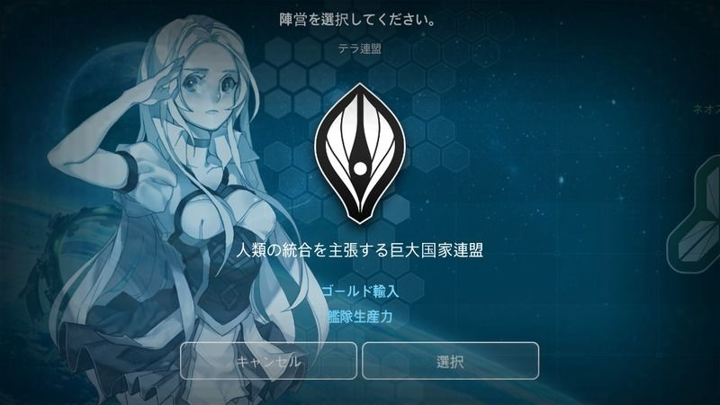
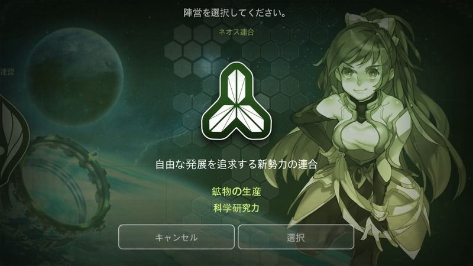

# 陣営

|テラ連盟|
| --- |
||
|人類の統合を主張する巨大国家連盟|
|ゴールド収入、艦隊生産力 +|
2525年、テラ連盟は地球の運命を決定づけた最終戦争後の瓦礫の上に結成された。

地球が核戦争で廃虚となり、資源が枯渇したことから、テラ連盟は宇宙の植民地開発に目を向けるようになった。

テラ連盟は、宇宙のあちこちに散った植民地の統制を強化し、連盟からの離脱を防ぐために、資金力と軍事力を増強させることによって、人類の最も強大な勢力として挙げられるようになった。

|ネオス連合|
| --- |
||
|自由な発展を追求する新勢力の連合|
|鉱物の生産、科学研究力 +|

ネオス連合の起源は、2170年に宇宙探査と開拓のために出発したある船団から遡ることとなる。

人類の繁栄は、環境汚染された地球で限界を迎えたことから、完全ではないながらも"超光速航行技術"が開発されるやいなや、多くの開拓船団を宇宙に送り出すことになった。

その中のある船団は、目的地であったネオス星系へのワープに失敗し、長期間漂流することになる。
この船団は、生きるための数年の死闘を終え、宇宙の向こうのさらに向こうに居住可能な惑星を発見し、定住する。

自分たちの座標さえ把握できなかった彼らは、自らの惑星を、最初の目的地であったネオスと名付けた。

それから数世紀後の2890年、コスメントをめぐるテラ連盟との紛争が発生したことによって、ネオスの繁栄を享受したネオス星系の近隣惑星と協力してネオス同盟を結成する。

劣悪な環境で生き残ったネオス人たちは鉱物の生産に長けており、また、科学技術研究に注力してきたお陰で研究所の効率が高く、テラ連盟とも互角に渡り合える力を手にしていた。