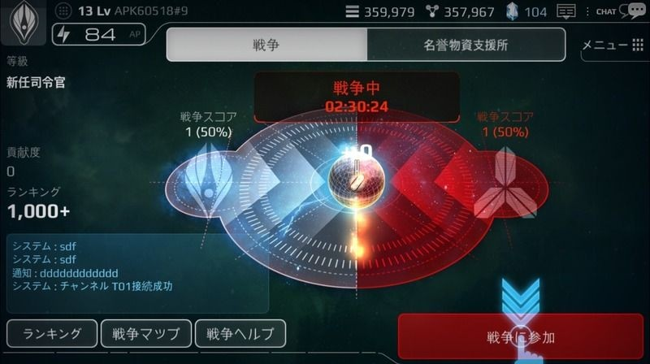
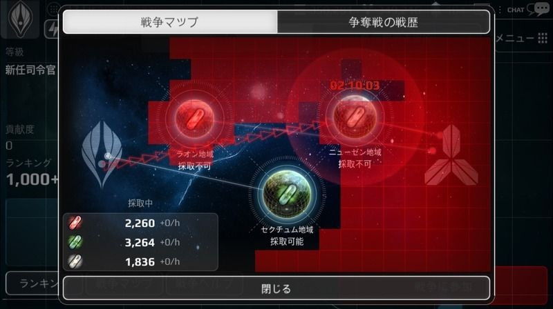
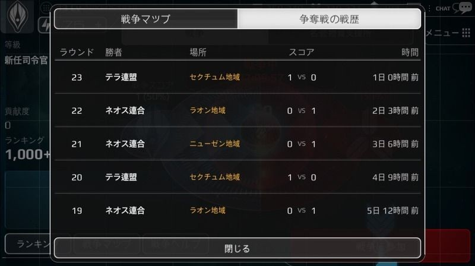
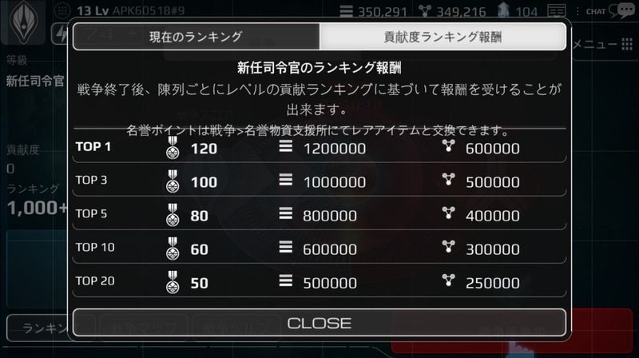

# 国力・ランキング

ユーザーは、テラ連合とネオス同盟のどちらか一つを選択し、戦争に参加することができます。

(戦争には、国家レベル10以上から参加可能。詳しくは、戦争ページをご覧ください)

自分の惑星に施設を建設し、新しい兵器と技術を研究し、戦争で勝利すると、国力という数値に反映されます。

この数値は、情報画面でも確認でき、現在の自分の立ち位置を確認できる尺度となります。

国力は、ランキング形式の順位でも表示されるため、自分が同盟の中でどの程度の位置にいるか確認できます。

国力を高め、高ランキングを達成すれば、称号とともに報酬を得ることができます。

