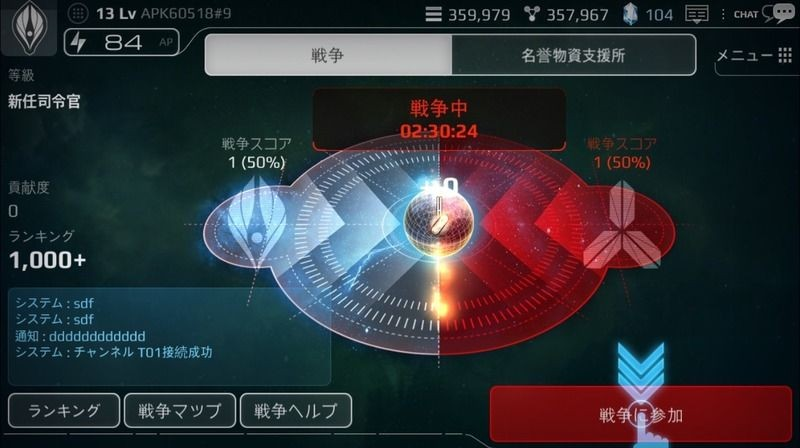
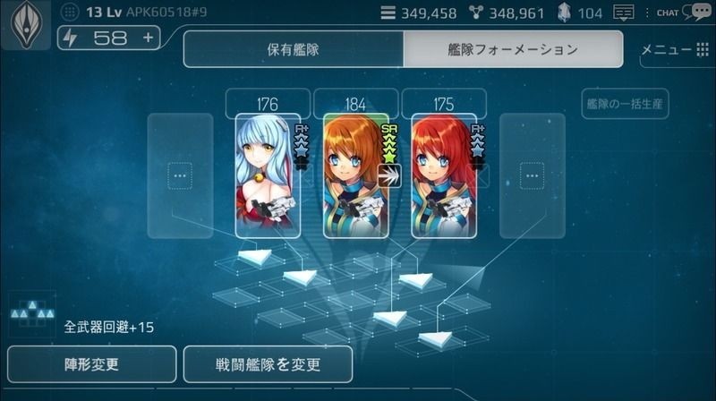

# 戦争システム

アストロアンドガールズで最も重要な要素は、

「戦争」で勝利して敵陣営より多くのコスメントを確保し、新型の艦隊と装備で武装することです。
 

戦争は、『コスメント』（ラオン、セクチュム、ニューゼン）をめぐって、両陣営が繰り広げる争いです。

この戦争は、それぞれ異なる三種のコスメントが生産できる地域をめぐって、日々進行しています。

戦争は24時間毎に終結し、該当する地域の戦いに勝利した陣営は48時間の間、該当するコスメントを獲得できます。

# 特殊任務
宇宙海賊を掃討するための特殊任務シナリオを進行できます。

宇宙海賊の略奪から身を守らなければ、戦争に集中できません。

宇宙海賊の活動を防ぎ、彼らを追跡し、アジトまで完全に掃討してこそ、私たちはコスメント確保に全力を傾けることができるようになります。

宇宙の様々な界域を彷徨い、飛び回っている宇宙海賊を撃破すると、レアアイテムやトロン部品を獲得することがあります。

トロン部品は、英雄をサポートするロボット――トロンを生成する際に必要となります。

宇宙海賊を掃討しながら広い宇宙を移動していると、非常に珍しい状況に置かれる時があります。

正体不明の外界艦隊との遭遇です。

私たちは、数多くの偵察部隊を派遣し、調査を繰り返してきましたが、彼らの正体は未だ掴めていません。

彼らは何のためにやって来るのか？

彼らは何が目的なのか？

この謎の艦隊は、とてつもない攻撃力と防御力で、私たちの艦隊を攻撃してくる脅威の存在です。

彼らと遭遇した際は自分の力だけでなく、同盟の力も借りることが賢明です。

同盟の艦隊と一緒ならば、どのようなことも恐れることはありません。

運が良ければ外界艦隊を撃退した際に、想像できないほど進歩した外界技術のキューブを得ることができます。

私たちの艦隊に外界技術を融合できれば、恐れることは何もありません。

# 練習戦闘

同盟と戦闘演習を実施することができます。

相手の艦隊構成・特徴・力を分析し、自分の艦隊の弱点を補うためにも練習戦闘に参加した方が良いでしょう。

時には、戦闘終了後に思いがけないプレゼントを受けとることもあります。
