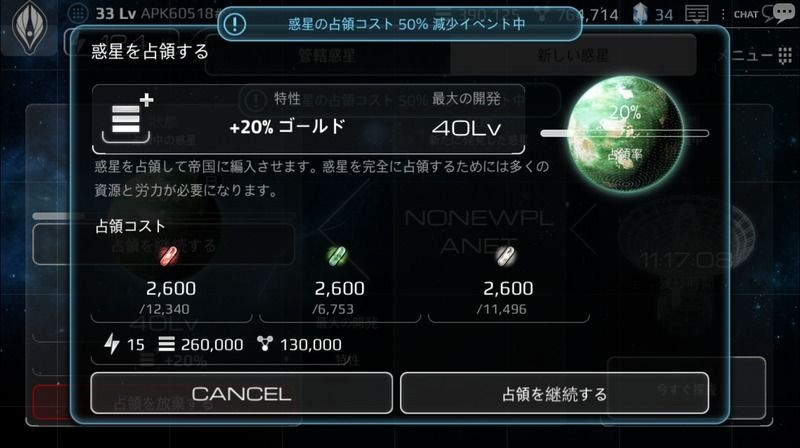

# 惑星探査

ゲーム開始時点では、ユーザーは惑星を1つ保有しています。
国家レベルが20以上になると、「惑星探査」および「占領」を開始することができます。

「惑星探査」は、「惑星」メニューの「新しい惑星」から実行できます。
「惑星探査」は、24時間毎に新しい惑星を自動的に発見します。
「惑星探査」で発見できる惑星の最大レベル・等級・環境は、ランダムに決定されます。

発見した惑星は、占領を完了することにより、ユーザーの保有惑星となります。
占領中でない惑星は、
・24時間経過する
・10クリスタルを使用して、新しい惑星を発見する
・惑星発見チケットを使用する
上記のいずれかが実行されると、消滅します。

惑星発見と占領

